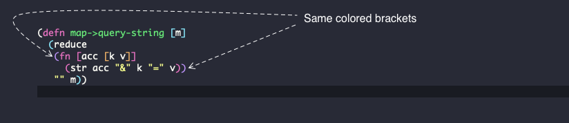

# Editor Tools

One of the major entry barrier to the world of Lisps is the weird syntax.

Here's what a function to convert a Hash Map to query string might look like (don't worry if it doesn't make sense, it soon will):

```clojure
(defn map->query-string [m]
	(reduce
		(fn [acc [k v]]
			(str acc "&" k "=" v))
			"" m))
```

At first glance, it's almost impossible to figure out function boundaries. Unlike C style languages, Lisp functions don't indent well.
It's also hard to keep track of parenthesis. A single misplaced bracket will cause the program to fail.

## Lisp code is a Tree
Lisp code is written in Tree form where as C style code is written in prose form. If you examine the code above, and assume round and square brackets to denote a collection, then the Tree structure becomes evident.

Tree based code is also referred as S-Expressions or sexp for short. The function defined above can be visualised as the tree below:


To mitigate this problem, we are going to install two tools: Paredit and Rainbow Params

## Paredit
Paredit is a structural editing plugin. It was originally built for Emacs, but well maintained ports exist for most major editors.

Paredit enables multiple hot keys that:
- let you easily maneuver Lisp code
- prevents accidental deletion of brackets.
- insert matching params
- move symbols in and out of parenthesis
- and much more

We'll learn about Paredit features in upcoming sections.

If this is the first time you are writing Lisp, this will feel annoying. It'll obstruct your natural flow. But as you get used to it, you'll hopefully start appreciating the ingenuity of this tool.

## Rainbow Params
Even after developing a sense of S-Expressions you might find it hard to visualise the scope of a function, ie. the point where the function starts and ends.

It will get worse as your functions start doing more complex tasks.

Rainbow params (name might differ depending on your editor), give a unique color to each pair of parenthesis. With this plugin, the function defined above will look as follows:



## REPL
Because Lisp is written in the form of Trees, it makes it really easy to update parts of the program on the fly. The REPL plugin is not related to the syntax, but the development lifecycle in general.

It's a common practice for most Lispy languages to have a REPL, which is a tool that helps with on-the-fly updates. The REPL also helps execute code inline and in some cases, act as an auto-completion system.

Again, if this doesn't make sense, don't worry. We have a chapter dedicated to the use of REPL as this is one of the most important features of the language.

## Editors supported by this course
Historically, Emacs is the top editor choice for coding in Lisp. However Lisp support is available for most major editors. For the purpose of this course, we are assuming that you have:
- VS Code,
- IntellJ IDE or
- Emacs

Except for the setup, the development workflow is identical for most other editors. With a few tweaks, you can easily get this working on Vim (Conjure) and Sublime. In case you cannot use one of the above editors, please contact us and we'll help you get started in your environment.

If you are an Emacs user already, we highly recommend that you use that. IntelliJ IDE has the best UX out of the box. It's also the most resource intensive. Emacs is the top choice and is used by over 40% of developers who participated in [State of Clojure 2020 Survey](https://clojure.org/news/2020/02/20/state-of-clojure-2020).


## Conclusion
In this chapter, we saw the tree structure of Lisp code and touched base with tools to help write S-Expressions. In the next sections, we'll actually install these tools and learn how to use them.
