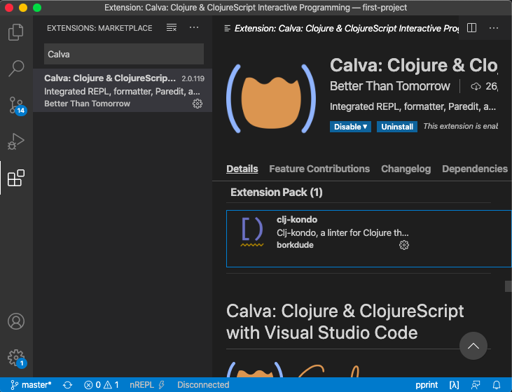

# VS Code Setup
The packages outlined in Editor Tools section ship as a bundle with [Calva](https://calva.io/).
For VS Code, you only need Calva to get started:
- Open VS Code
- Press `Ctrl/Cmd + Shift + P`
- Search for "Install extension"
- Search for "Calva" in extensions marketplace
- Press the `Install` button
- Done!

Calva also installs `clj-kondo`, a Clojure linter that you'll definitely find useful.
