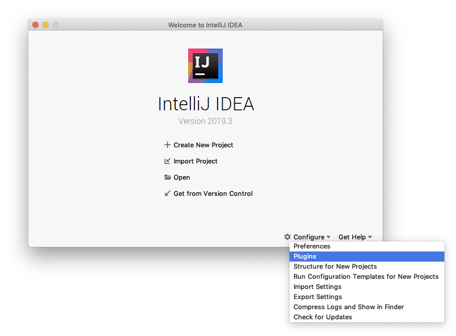

# IntelliJ IDE Setup
We recommend using the [Cursive Plugin](https://cursive-ide.com/) with IntelliJ for Clojure development. IntelliJ has a free non-commercial use [license](https://cursive-ide.com/buy.html) and options for a paid commercial use license.

The installation is straight forward:

*Image credits: [Cursive User Guide](https://cursive-ide.com/userguide/)*

- On the splash screen, click the "Configure" button
- Select the "Plugins" option
- Search for "Cursive" in the plugins menu
- Install the package "Cursive" by "Ideogram Ltd."

Cursive comes bundled with all tools listed in Editor tools chapter. No further steps are required.
