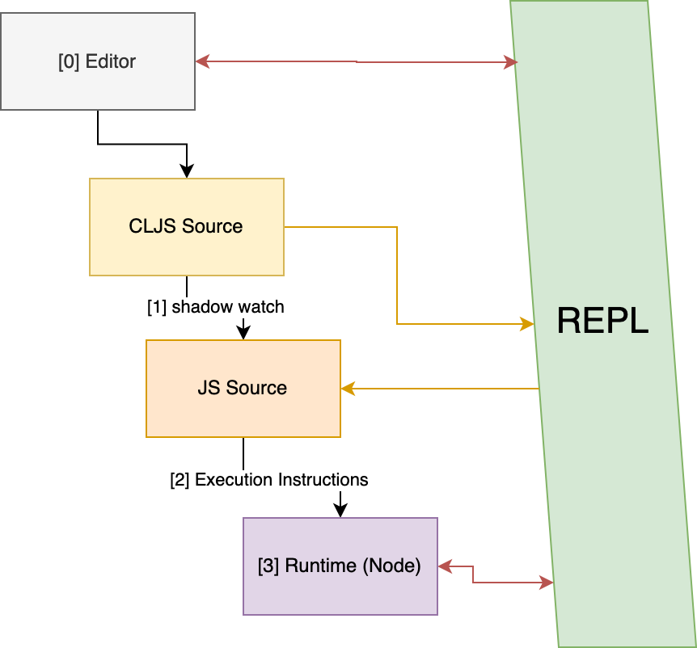
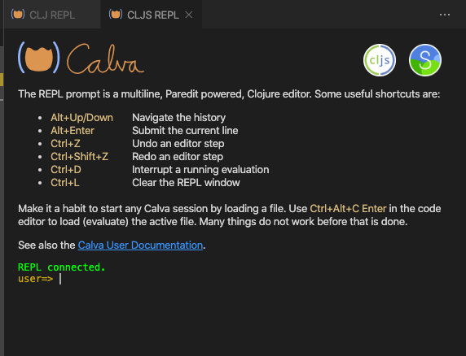

# NREPL and Inline Evaluation

REPL stands for Read (source string), Eval (source string), Print (result), and Loop.

According to the official Clojure docs, [the REPL is a user interface to your program](https://clojure.org/guides/repl/guidelines_for_repl_aided_development).

Clojure is a hosted language. In our case, ClojureScript is hosted on JavaScript (Node or the browser). This means that at a given moment, there are two sets of code available: CLJS code that we wrote and the JS code that the build tool produced.

To test our code, we need the JS version to run. But modifications are made to the CLJS version. The REPL provides a bi-directional bridge between these two realms. It lets you control the execution of code in the JavaScript realm, without leaving the ClojureScript realm.

## Inline Evaluation Demo
Inline evaluation is a niche concept. Instead of building the concept bottom up, let's see the final product and tear it top down. We are going to use the `first-project` with Shadow for this demo:


Notice how we evaluate the code inline. Inline Evaluation leverages the NREPL to execute code inline. This lets us develop and debug functions without leaving the editor. Inline evaluation is not limited to core functions. In the demo, we defined a new function, evaluated the `defn`, so it's available in the namespace, and then called that function inline. You can also evaluate third-party libraries, refer to inline docs, and a lot more. Inline eval. is a Lisper's Swiss Army Knife.

Something like React's Hot Reload compiles your code each time you save, so the newer version is available in your browser. Inline evaluation lets you completely bypass the browser (or runtime) and lets you evaluate your code right in your editor. 

Our `first-project` was configured to run as a Node script, so the inline execution of the code happens in a Node env, and the REPL serves as a bridge. In this chapter, we'll connect the REPL to your editor.


## Scope of the REPL

We have introduced multiple tools to our process so far. Let's see how everything fits in the big picture.



0. You write ClojureScript code in your text editor (we already have the source for `first-project`)
1. Shadow `watch` converts your CLJS code to valid JavaScript code (can be run using `yarn shadow-cljs watch :script`)
2. You can execute a command that will run the JS code in the Node environment, as we did earlier (with `node build/node-script/core.js` in another terminal)
3. The Node (or runtime) executes the code and exits (or not)

Do you recall that the Node script did not exit while Shadow was running in `watch` mode?

This is because the REPL needs the runtime for inline evaluation. The REPL is a bridge between the CLJS source and the runtime. Where Shadow converts your code to be ready for the runtime, the REPL can initiate the execution, update functionality without full rebuilds and get the output from runtime back to the editor. This is why the REPL is a user interface for your program.


## Connecting your editor to the NREPL
If you followed the steps in the last section, you'd have your source open in your editor, Shadow watch in a terminal, and the Node script in another terminal.

We have configured NREPL to run on port 9000, so let's connect our editor to it. We will talk about multiple editors, but you only need to follow the section that applies to your editor of choice.

### Connecting VS Code and Calva

Open the first project folder in VS Code. On the bottom left corner, you should see a button for NREPL with the status `disconnected`. If you don't see this button, refer to the `Getting Started` section and ensure your editor is set up correctly.

Click on the NREPL button and click `Connect to running REPL server in project`. 
You can also type `Ctrl/Cmd+Shift+p` and then search for `Calva: connect to running repl server in project`.

You'll be asked for a host and port. Most probably, Calva will read your config and autofill this information. If that doesn't happen, enter localhost:9000. We configured this port for REPL in Shadow config.

In the choice of REPLs, choose `Shadow CLJS REPL`. In the choice of the builds to connect to, choose `:script`.

You should see a Calva window with the message `REPL Connected`. The NREPL status on the bottom left of the editor will also turn golden yellow, indicating the connection was successful:



To verify the connection, open the `first-project.core` namespace (this namespace is located at `src/first_project/core.cljs`) and type a simple expression at the bottom of the file, say `(* 4 5)`.

Now bring your cursor at the end of this line and press `Ctrl/Cmd+Shift+p`. In the command menu, search for `Calva: Evaluate current form` and hit enter. You should see the result flash like `=> 20`.

Next try and print a message to your runtime (ie the Node script running in the terminal). Evaluate `(println :hi)`. This should flash `=> nil`. Now check your terminal, you should see `:hi` printed.

:::note
Calling inline eval. with the command, the menu might become tedious. We recommend that you assign the shortcut `Ctrl+x+e` to this command.
:::

### Connecting Emacs and Cider
Emacs need an extra dependency in your project in order for the Cider integration to work. Add the `cider-nrepl` dependency to your Shadow config:

{lang=clojure,crop-start-line=2,crop-end-line=5}
<<[first-project/shadow-cljs.edn](./protected/source_code/first-project/shadow-cljs.edn)

You will need to restart Shadow `watch` after saving changes to the config.

To connect to the NREPL, we need `M-x cider-connect`. In the prompt for address, enter `localhost` and hit enter. In the next prompt for port enter `9000` and hit enter.

A Cider buffer should open up with some information about Cider and NREPL. In the prompt `user=> ` enter `(shadow/repl :script)`. This tells Cider to use the `:script` target for this REPL session.

Now switch to the `first-project.core` buffer and make sure that `cider-mode` is enabled. You should see an indication in your status bar/ powerline. You can enable or disable `cider-mode` with `M-x cider-mode`.

To verify the connection, enter the expression `(* 5 4)` in the `first-project.core` buffer. Then place your cursor at the end of this expression and evaluate it using `C-x e`. You should see the result `=> 20` flash next to the cursor.

Try executing another expression `(println :hi)`. This should flash `=> nil` and `:hi` should be printed in your runtime, ie the Node script running in the terminal.

### Connecting IntelliJ and Cursive

## What happened here?
When you evaluate a form, your editor passes it to the REPL. The REPL figures out the relevant JavaScript code that should be run, and executes it in the connected runtime. In our case, that runtime is Node (position #3 in Figure: Scope of REPL). The code is executed, and any returned values are flashed inline. When we printed a message, our output went to STDOUT (ie the terminal). The inline eval. flashed `=> nil` because `println` doesn't return anything.

## Perils of the REPL
The REPL provides excellent feedback but can also lead to some problems. It's a tool to aid your development process, it's not a substitute for your development process.

### Hanging Code
We entered some arbitrary code in the `first-project.core` namespace to eval it inline. It's fine right now, but imagine you ship this code to production. The program will evaluate the multiplication and print function each time this namespace loads.

It's always a good idea to put code for REPL inside the `comment` function, like so:

```clojure
(comment
  (* 4 5)
  (println :hi))
```

The comment function is an alternative to literate form comments (ie. the ones that start with `;;`). This type of comment that holds code to be run exclusively at dev. time is also known as a Rich Comment.

### Impression of progress
You can make progress in the REPL but at the end of the day, your program needs to run somewhere else. Getting something working in the REPL is not the same as being production-ready. Think of the REPL as an inspection tool. It shines when you are working with pure functions. As we progress in this course and start writing more code, we'll understand how to best leverage the REPL.

You should also make it a habit of saving your files. With the REPL, you can define functions in a namespace and run them, without actually saving the file. This means when your REPL restarts, the function will not be available and your code might break!

## Keep NREPL always on
You might have noticed slow startup time and the added burden of connecting to the NREPL. It's a common practice to never kill the `watch` and the REPL session. This way, whenever you sit down to work, your toolkit will be ready.

## Conclusion
In this chapter, we learned about the REPL and how to evaluate code inline. We built a mental model for the REPL and studied some of its advantages and shortcomings.


## Recommended watch

- [Running with Scissors](https://www.youtube.com/watch?v=Qx0-pViyIDU) by [Stuart Halloway](https://twitter.com/stuarthalloway)
