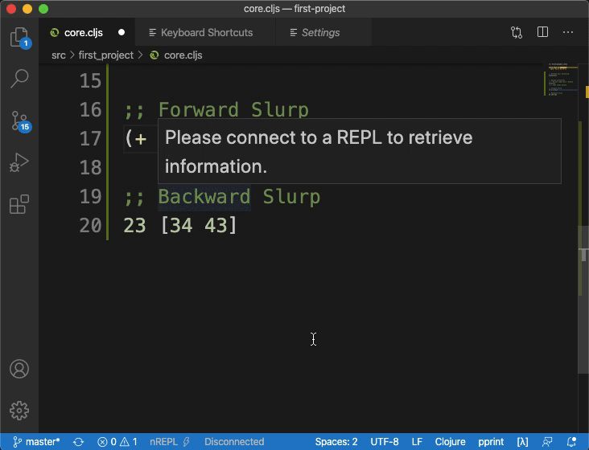

# Paredit

Paredit helps with structural editing. In non-jargon terms, it's a tool to aid the writing of S-Expressions. Since Paredit is dependant on the editor you use, we'll only cover the core features in this chapter. In the end, we'll share links to editor specific resources.

The presentation style of this chapter was inspired by [Dan Midwood](http://danmidwood.com/)'s [Animated guide to Paredit](http://danmidwood.com/content/2014/11/21/animated-paredit.html).

Paredit is an indispensable part of a Lisper's toolkit. This chapter is a cheat sheet that you can refer back to as you progress in the course.

We installed Paredit in the `Getting Started` section. If you are a VSCode user, you don't need to install Paredit separately as it comes bundled with Calva. 

We are going to reuse the `first-project.core` namespace to test various Paredit features. We suggest you follow along!

## Bracket pair balancing
You have probably observed this already when you open a bracket, Paredit automatically adds the closing bracket.
The same is true when you delete a bracket, the closing part is deleted automatically.

## Delete protection
Paredit prevents accidental deletion of brackets by only allowing to delete leaf nodes of the S-Expression.
If you try to delete a parent node, the cursor just moves back.

Notice how the cursor just moves back when I press `backspace` on a form with children on line `13`.
Whereas the forms which don't have any children (i.e. child forms) are deleted on line `15`.

Delete protection helps as your forms become more complex. At first, you might find it a bit annoying, but you'll soon get used to it.

## Forward and backward Slurp
Slurp engulfs a form into a list. Forward Slurp engulfs the form immediately next to the end of the list whereas backward Slurp engulfs a form immediately preceding a list.

The keyboard shortcuts Slurp depends on the editor you are using. We have noticed that these shortcuts sometimes conflict with the OS or existing shortcuts. You might need to rebind some commands depending on your setup (especially if you are using Mac). The default shortcuts are:

| Command | VS Code | Emacs | IntelliJ |
|---|---|---|---|
| Slurp forwards | Ctrl+Right Arrow | Ctrl+Shift+) | Ctrl+Shift+K |
| Slurp backwards | Ctrl+Shift+Left Arrow | Ctrl+Shift+( | Ctrl+Alt+J|

If you are looking to rebind your keys, we suggest using Emacs bindings. That's what we have in the demo.

## Forward and backward Barf
Barf pushes a form out of the list. Forward Barf removes the rightmost form and backward Barf removes the left most form.

| Command | VS Code | Emacs | IntelliJ |
|---|---|---|---|
| Barf forwards | Ctrl+Left Arrow | Ctrl+Shift+} | Ctrl+Shift+J |
| Barf backwards | Ctrl+Shift+Right Arrow | Ctrl+Shift+{ | Ctrl+Alt+K|

## Splice or unwrap
Splicing kills the list while keeping its children intact.

| Command | VS Code | Emacs | IntelliJ |
|---|---|---|---|
| Splice | Ctrl+Alt+S | M-s | Alt-S |

## Wrap-around
Wrap surrounds an S-Expression with brackets or quotes.

| Command | VS Code | Emacs | IntelliJ |
|---|---|---|---|
| Wrap with quotes | Ctrl+Alt+Shift+Q | M-" | Ctrl+Shift+" |
| Wrap with parenthesis | Ctrl+Alt+Shift+P | M-( | Ctrl + ( |
| Wrap with square bracket | Ctrl+Alt+Shift+S | M-x paredit-wrap-square | Ctrl + [ |
| Wrap with curly bracket | Ctrl+Alt+Shift+C | M-x paredit-wrap-curly | Ctrl + { |

:::note
If you are an Emacs user, we suggest adding custom shortcuts: `M-[` for square wrap and `M-{` for the curly wrap.
:::

## External resources
This chapter covers the absolute necessities of using Paredit. However, Paredit has a lot more to offer. Depending on your editor, you can check these amazing resources:

|Editor|Author|Link|
|---|---|---|
|VS Code| Calva Docs | [Article](https://calva.io/paredit/) |
|Cursive| Cursive Docs | [Article](https://cursive-ide.com/userguide/paredit.html) |
|Cursive| John Madison | [Video](https://www.youtube.com/watch?v=18WtDzYHKCI) |
|Cursive| Cheatorgraphy.com | [Cheatsheets](https://cheatography.com/tag/cursive/) |
|Emacs| Dan Midwoord | [Article](http://danmidwood.com/content/2014/11/21/animated-paredit.html) |
|Emacs| Artur Malabarba | [Article](https://endlessparentheses.com/a-few-paredit-keys-that-take-over-the-world.html) |

- VS Code | Calva Docs | [Article](https://calva.io/paredit/) |
- Cursive | Cursive Docs | [Article](https://cursive-ide.com/userguide/paredit.html) |
- Cursive | John Madison | [Video](https://www.youtube.com/watch?v=18WtDzYHKCI) |
- Cursive | Cheatorgraphy.com | [Cheatsheets](https://cheatography.com/tag/cursive/) |
- Emacs | Dan Midwoord | [Article](http://danmidwood.com/content/2014/11/21/animated-paredit.html) |
- Emacs | Artur Malabarba | [Article](https://endlessparentheses.com/a-few-paredit-keys-that-take-over-the-world.html) |

## Conclusion
In this chapter, we learned about Paredit and structural editing. There is a high probability that you find it annoying. Paredit is a tool that all Lisper's learn to appreciate. Just give it some time and let it settle. Once you understand the basics, your code will feel terser and easy to edit.

It will not be reasonable to assume that one can learn all these commands in one sitting. The truth is that you don't need to. Keep this chapter as a reference. Come back to it when need be. And over time, these commands will make their way to your muscle memory. We suggest that you focus on Slurp and Barf to get started. We also suggest that you rebind your keys to make Paredit more ergonomic, especially if you use VS Code.

