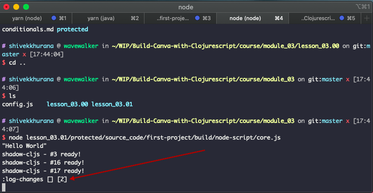

# Atoms
All Clojure data structures are immutable but the real world might not be. Any useful application will have some state that changes over time. Clojure atoms are thread-safe constructs to accommodate  mutable state.

In a true multi-threaded environment like JVM, atoms guarantee atomic updates across threads.

The examples in the chapter reside in the `first-project.atoms` namespace. We suggest you create this file and follow along!

## Create an atom
New atoms can be created using the `atom` function. The first argument is the initial value. This initial value can be anything: number, maps, functions, other atoms, etc.

{lang=clojure,crop-start-line=4,crop-end-line=8}
<<[first-project/src/first_project/atoms.cljs](./protected/source_code/first-project/src/first_project/atoms.cljs)

The `atom` function also takes two optional keyword arguments:
- `:validator`: A predicate that's run before updating the value of the atom, if this returns false, the value is not updated
- `:metadata-map`: Key-value pairs to hold atom's metadata

If you eval an atom inline, you'd see it's initial value and the wrapping object. This might differ depending on the language underneath. For JavaScript it looks like:

{lang=clojure,crop-start-line=11,crop-end-line=11}
<<[first-project/src/first_project/atoms.cljs](./protected/source_code/first-project/src/first_project/atoms.cljs)


## Get atom's current value
A Clojure atom is an instance of a Clojure ref (reference). We'll not go into details of refs. But you can think of a ref as a base class for an atom.

To get the current value of an atom (or any ref), we can use the `deref` method. There are two ways to `deref`:

1. Literal way using `@` prefix
2. Functional way using `deref` function

{lang=clojure,crop-start-line=14,crop-end-line=15}
<<[first-project/src/first_project/atoms.cljs](./protected/source_code/first-project/src/first_project/atoms.cljs)

## Reset current value
If you want to update the value without caring about the initial value, you can use the `reset!` function. This function takes two arguments, the atom to reset and its new value.

The functions ending with an exclamation sign conventionally denote an unsafe or impure operations. The exclamation sign is usually read as "bang".

If the new value was set on the atom, the newly set value is returned and the atom is updated in place. If the value was not set, ie. failed validation, an error is raised and the atom is left untouched.

{lang=clojure,crop-start-line=19,crop-end-line=22}
<<[first-project/src/first_project/atoms.cljs](./protected/source_code/first-project/src/first_project/atoms.cljs)

## Swap current value
In cases where the update depends on the previous state of the atom, for example adding to a vector, the `swap!` function can be used.

`swap!`'s signature is `(swap! atom f & args)`. `& args` signify 0 or more additional arguments.

`f` is a pure function that is called with the current value of the atom and the new args: `(f @atom & args)`. The atom's value is updated to the return value of this function and the newly set value is returned.

{lang=clojure,crop-start-line=25,crop-end-line=33}
<<[first-project/src/first_project/atoms.cljs](./protected/source_code/first-project/src/first_project/atoms.cljs)

`conj` and `pop` add an element and remove the last element from a vector respectively. `assoc` (or associate) adds a key-value pair to a map.

Do you recall your first encounter with these functions in the `Syntax and Native Data Types` chapter? Do you remember how the immutable nature of these operations?

`(assoc {} :a :b)` doesn't update the original map, but returns a new one. Atoms help us mutate state safely.

## Watch for changes
You can add a hook that watches changes made to atom's state. This is useful in cases where you want an impure operation to run after the state has changed. For example, you might want to log the changes or re-render a UI when the atom updates.

The `add-watch` function takes an atom, an identifier keyword and a function to be called when the state changes.

{lang=clojure,crop-start-line=37,crop-end-line=40}
<<[first-project/src/first_project/atoms.cljs](./protected/source_code/first-project/src/first_project/atoms.cljs)

When the `reset!` function is executed, a log statement is printed in the runtime, ie. the running Node Script:



A watcher can be removed using the `remove-watch` function:

{lang=clojure,crop-start-line=42,crop-end-line=42}
<<[first-project/src/first_project/atoms.cljs](./protected/source_code/first-project/src/first_project/atoms.cljs)

## Local atoms with `let` bindings
So far, all atoms that we used were defined using the `def` macro. The variables produced using `def` are global in that namespace. The `let` function lets you define local variables:

```clojure
(let [a (atom 0)
      b (atom {})
	  c :any-other-data-type]
  ;; a is defined only in this scope
  a)
```

A `let` definition is also called a "let binding". `let` requires a vector with an even number of elements. The variables defined in a `let` binding are available only inside the `let` closure. The last element on the `let` list is the return value. In the example above the atom, `a` will be returned on evaluation.

The usage of the `let` binding is not limited to atoms. Any valid Clojure data type/structure can be defined in a `let` binding.

## Conclusion
In this chapter, we learned about atoms and how to handle mutable state. We learned how to watch for changes and execute side effects. 

We also saw usage of local variables with `let` bindings.

