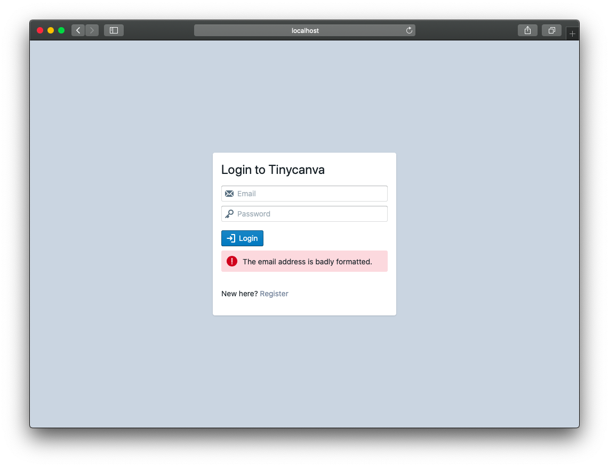
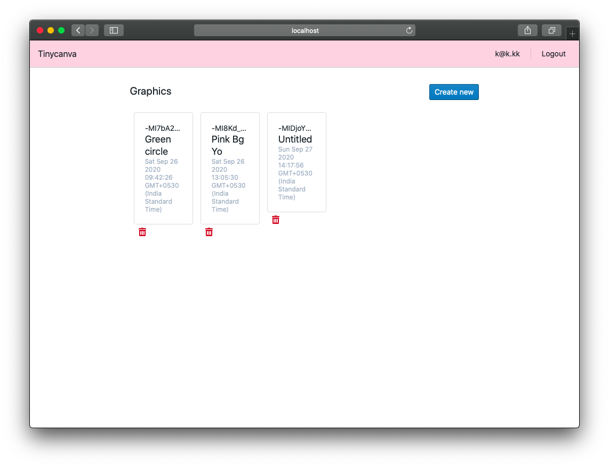
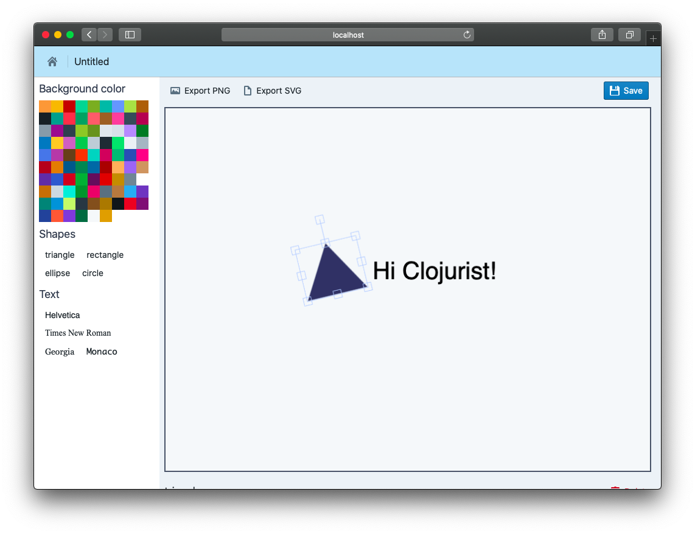
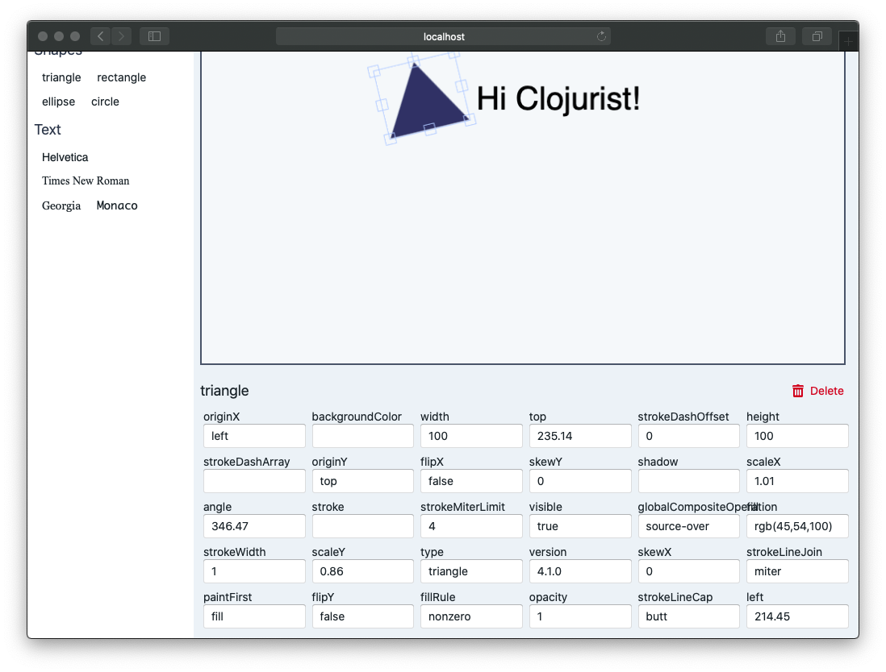

# Overview

[Canva](https://canva.com) is an online graphics and video editing platform. It was founder by [Melanie Perkins in 2007](https://www.canva.com/en_in/story/).

We chose Canva because of the challenges a web-based graphics editor presents. It requires interaction with DOM, HTML Canvas, and JavaScript apart from the traditional frontend tasks like routing and state management. The app we are going to build will in no way be close to the actual Canva editor. But we'd learn all the techniques required to build a JS application of all types. 

## Tinycanva
The Tinycanva app will be a single page application, with support for:

- Authentication: Using Firebase Auth
- Authorization: Private and public routes
- CRUD UI: With Firebase DB and
- Graphics Editor: Using FabricJS, a wrapper for HTML5 Canvas

In terms of the implementation, we'll use Reagent, a CLJS wrapper for React. We'll learn how to manage state locally and globally using reactive atoms (Reagent's built-in local state solution) and Reframe (A flux library for ClojureScript). For routing, we'll work with React Router.

This mix showcases the power of Clojure in various conditions like consuming JS libraries and integrating with React. In the process of building this app, we'll learn more about Clojure's dev. workflow, it's API, Paredit, and the REPL.

In the end, we'll learn about advanced concepts like code-splitting, production bundles, and unit testing. 

## Screenshots

Here's a preview of what you can expect:

- Login Screen

- Dashboard

- Graphics Editor

- Graphics Control Panel

## Conclusion
By the end of this module, you will have a fully functional application. You'll have practical experience with how things fit-in. We also hope that the app built in this module will serve as a starting point for your own Clojure projects.

