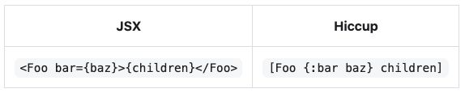
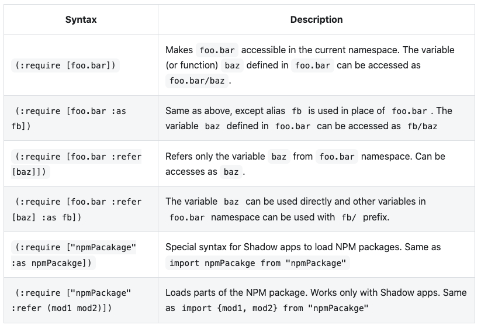
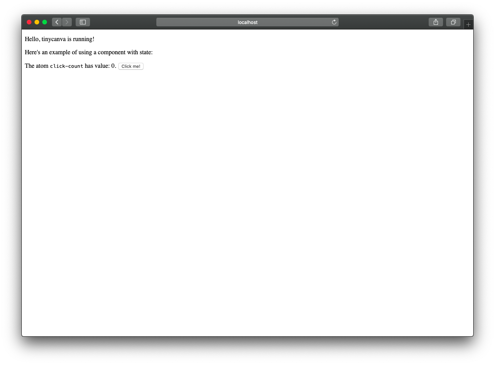

# Project Setup
We have already learned how to set up Shadow projects manually. We have also used the `first-project` for code examples in the last module. Unlike `first-project` Tinycanva will run in the browser instead of Node terminal. So, to get the REPL working, we'll need to open the app in a browser, in place of running the node script in the shell.

## Create a new project
The app we are going to build is called *Tinycanva*. We'll use `create-cljs-app` to bootstrap the project:

```bash
yarn create cljs-app tinycanva
# or npx create-cljs-app tinycanva
```
In time, we'll make changes to the template project. `create-cljs-app` automatically installs some modules that we'll cover in this chapter.
Once done, you should see a directory named `tinycanva` with the following contents:
```bash
$ tree -I node_modules
.
└── tinycanva
    ├── README.md
    ├── package.json
    ├── public
    │   ├── css
    │   │   └── style.css
    │   ├── favicon.ico
    │   └── index.html
    ├── shadow-cljs.edn
    ├── src
    │   ├── app
    │   │   ├── cards.cljs
    │   │   ├── core.cljs
    │   │   ├── hello.cljs
    │   │   └── hello_cards.cljs
    │   └── e2e
    │       └── core.cljs
    └── yarn.lock

6 directories, 12 files
```

The files and directories created by `create-cljs-app` might feel overwhelming at first. Let's break it down so we understand what's happening.

## Understanding Shadow configuration
The automatically generated Shadow config should look similar to:

{lang=clojure}
<<[tinycanva/shadow-cljs.edn](./protected/source_code/tinycanva/shadow-cljs.edn)

By default, we have four builds, a development server configured to run on port 3000 serving contents from the `public` directory. An NREPL server configured on port 3333 and one source path `src`. We also have two dependencies that we'll learn about in detail soon:
- [Reagent](https://reagent-project.github.io/): Minimalist Clojure wrapper for React and
- [Devcards](https://github.com/bhauman/devcards): A StoryBook like tool for developing components in isolation

As of now, we should only be concerned with the `:app` build target. The other build targets `:test`, `:e2e`, and `:cards` are meant for testing the app.

The `:app` is configured to call `app.core/main` function on startup, targets the browser runtime and spits JavaScript code to `public/js`. Let's check the `main` function definition.

## The `main` function
As we [learnt before](/courses/tinycanva/language-semantics-shadow-cljs-api/#modules), the function defined as `:init-fn` is called as soon as the app is ready. The generated `app.core` namespace is:

{lang=clojure}
<<[tinycanva/src/app/core.cljs](./protected/source_code/tinycanva/src/app/core.cljs)

This might look a little different from the namespaces and functions we have defined so far.

### Namespace definition
The `ns` definition accepts a documentation string, just like function definition. The `:require` form can be passed to `ns` definition along with vectors of namespaces needed. We load `reagent.core` namespace and alias it as `r`. And then the `app.hello` namespace. `app.hello` is defined in `src/app/hello.cljs`. This namespace holds the definition for `hello` function:

{lang=clojure,crop-start-line=13,crop-end-line=17}
<<[tinycanva/src/app/hello.cljs](./protected/source_code/tinycanva/src/app/hello.cljs)

This function was generated by `create-cljs-app` and is the Reagent version of a functional component. Like React uses JSX to define components, Reagent uses Hiccup. Hiccup and JSX can be translated seamlessly:

| JSX                               | Hiccup                      |
|-----------------------------------|-----------------------------|
| `<Foo bar={baz}>{children}</Foo>` | `[Foo {:bar baz} children]` |



Don't worry if this doesn't make sense. It will soon. All we need to know right now is that `app.core/main` is the entry point of this app.

### Requiring libraries
Third-party libraries define their custom namespaces that you can `:require`. In the example above, we `:require`d `reagent.core`. There are multiple ways to do so:

| Syntax                                         | Description                                                                                                                                  |
|------------------------------------------------|----------------------------------------------------------------------------------------------------------------------------------------------|
| `(:require [foo.bar])`                         | Makes `foo.bar` accessible in the current namespace. The variable (or function) `baz` defined in `foo.bar` can be accessed as `foo.bar/baz`. |
| `(:require [foo.bar :as fb])`                  | Same as above, except alias `fb` is used in place of `foo.bar`. The variable `baz` defined in `foo.bar` can be accessed as `fb/baz`          |
| `(:require [foo.bar :refer [baz]])`            | Refers only the variable `baz` from `foo.bar` namespace. Can be accesses as `baz`.                                                           |
| `(:require [foo.bar :refer [baz] :as fb])`     | The variable `baz` can be used directly and other variables in `foo.bar` namespace can be used with `fb/` prefix.                            |
| `(:require ["npmPacakage" :as npmPacakge])`    | Special syntax for Shadow apps to load NPM packages. Same as `import npmPacakge from "npmPackage"`                                           |
| `(:require ["npmPackage" :refer (mod1 mod2)])` | Loads parts of the NPM package. Works only with Shadow apps. Same as `import {mod1, mod2} from "npmPacakge"`                                                                                                                                            |



### Function metadata
This function interops with JavaScript to find the DOM element with the id `app`. And then calls Reagent's render method with the DOM element and `hello` component.

The `^:dev/after-load` denotes metadata attached to a function. In this case, the metadata is to let Shadow know that the render function should be called each time the app code is hot reloaded. `:dev/after-load` is a Shadow lifecycle hook.

During production compilation, Shadow minifies and uglifies code. Uglification renames variables and function definitions. But we need the `main` function to stay intact, so it can be called when the app loads (`app.core/main` is the `:init-fn`). Functions marked with `:export` are not renamed.


## Node `package.json`
`create-cljs-app` creates a sane `package.json` as well. It adds React as a dependency and also defines scripts to run, test, and package the application. You can inspect `package.json` and analyze all scripts. For now, we only care about:
- `start`: Starts the application in dev mode and
- `build`: Compiles the application in production mode

## `public` directory
Our `first-project` was a `:node-script` and could be executed in a terminal. But the code produced via `:browser` target needs a web browser to run. The public directory contains files that will be served to the browser via a development server. The `index.html` file loads the compiled script. It also defines a `div` with an id of `app` which is used by the `app.core/render` function to render the React application:

{lang=html,crop-start-line=10,crop-end-line=16}
<<[tinycanva/public/index.html](./protected/source_code/tinycanva/public/index.html)

The public directory also has a top-level stylesheet. Other assets like fonts, images, etc. can also be placed here.

## Starting the app
There are some other files related to testing that we will explore soon. But for now, we can jump straight to starting our app:
```bash
yarn start
shadow-cljs - HTTP server available at http://localhost:3000
shadow-cljs - server version: 2.8.110 running at http://localhost:9630
shadow-cljs - nREPL server started on port 3333
shadow-cljs - watching build :app
[:app] Configuring build.
[:app] Compiling ...
[:app] Build completed. (159 files, 158 compiled, 0 warnings, 56.46s)
```

On visiting `localhost:3000` in the browser, you will see the `hello` component in action:



## Conclusion
In this chapter, we created a React/Reagent application using the `create-cljs-app` tool. We walked through some components that were automatically generated and started the application. We saw how `defn` can be used with metadata, and checked examples of Hiccup and `:require` forms.


