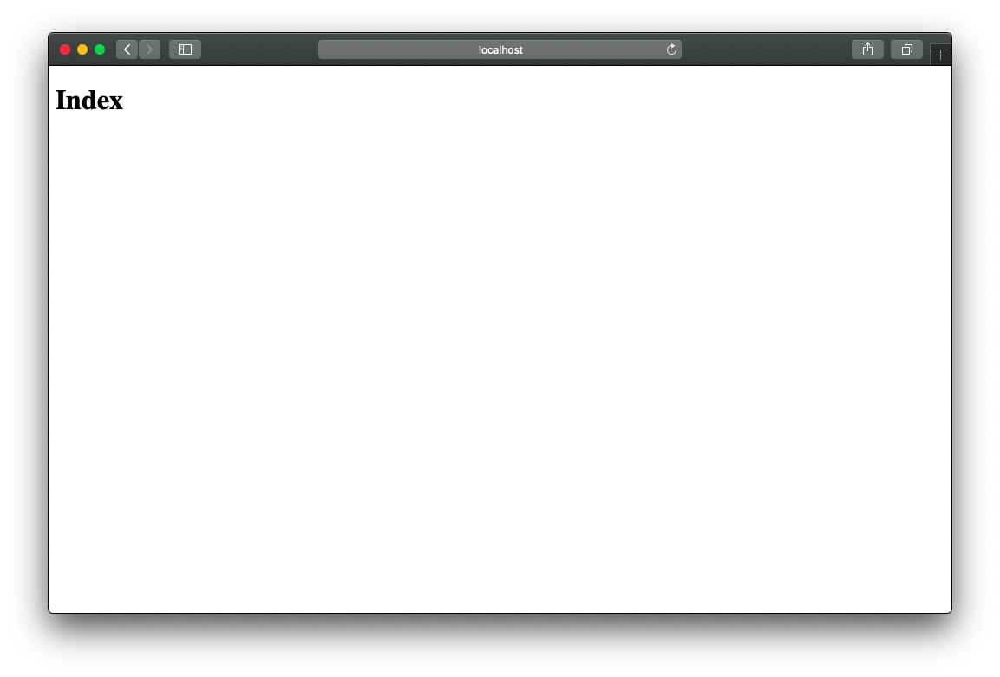

# React Router
There are [many](https://github.com/metosin/reitit) [options](https://github.com/juxt/bidi) for [SPA routing](https://github.com/funcool/bide) in [CLJS](https://github.com/domkm/silk) world. Most CLJS routers tend to be data driven and work seamlessly on the frontend and the backend.

But React Router is far more popular than any CLJS solution, and it plays well with React, perhaps better than most CLJS routers. One of the reasons behind this is that RR encapsulates routing into React components making it easy to reason for. We'll use RR for the Tinycanva application. We have assumed that you are familiar with the concepts of React Router. If not, we suggest that you watch this [JS tutorial on React Router](https://www.youtube.com/watch?v=Law7wfdg_ls) by [Dev Ed](https://www.youtube.com/channel/UClb90NQQcskPUGDIXsQEz5Q).

## Routes required
We need to be able to register and log in. We also need a list view that lists all the graphics a user has created. Then we'll have a route to edit a graphic by id. Also a catch-all 404, ie. these are the routes we need to account for:

- / (index page with links to login and register)
- /register
- /login
- /graphics (list view)
- /graphics/:id
- /not-found

## Structuring routes
There are multiple ways to structure a React app with React Router. Some developers define all the routes in the same place. Some others let routes grow organically.

We don't have any opinion on how you should go about that. But for this course, we'll define the top-level routes in `app.core` and the children routes in the respective component, ie. the `/graphics/:id` route will be defined in the component rendered by `/graphics`.

Again, if it doesn't make sense, don't worry. We'll walk through each part in detail.

## Installing React Router
We need the package `react-router-dom` to get the RR for browser:
```bash
yarn add react-router-dom
# or npm install react-router-dom
```

Once installed, the modules exposed by `react-router-dom` can be required in CLJS code using Shadow's require syntax:
```clojure
(ns foo.bar
	(:require ["react-router-dom" :refer (BrowserRouter Switch Route Link)]))
```

The above statement is equivalent to:
```js
import {BrowserRouter, Switch, Route, Link} from "react-router-dom";
```

## Cleaning the core namespace
The core namespace is the entry point of our SPA. We'll make the Router the root component of the application. But before that, we need to delete some code that we added in the last chapter. You should only have the `ns` definition, the `main` function, and the `render` function in the `app.core` namespace. Everything else can be purged.

Once done, `app.core` similar to what the `create-cljs-app` generated:
```clojure
(ns app.core
  "This namespace contains your application and is the entrypoint for 'yarn start'."
  (:require [reagent.core :as r]))

(defn ^:dev/after-load render
  "Render the toplevel component for this app."
  []
  (r/render [:div "Hello"] (.getElementById js/document "app")))

(defn ^:export main
  "Run application startup logic."
  []
  (render))
```

We also removed `app.hello` from the render function and from the `:require` form.

## Require React Router Components
We need three components for our initial setup: `BrowserRouter`, `Switch` and `Route`. This can be achieved by adding the following vector to `:require` form:

{lang=clojure,crop-start-line=4,crop-end-line=4}
<<[tinycanva/src/app/core.cljs](./protected/source_code/tinycanva/src/app/core.cljs)


## Creating a placeholder component

We'll create some routes now, but we don't have any components ready. To make things easy to understand, we'll create a `placeholder` component that renders a `title`:

{lang=clojure,crop-start-line=8,crop-end-line=9}
<<[tinycanva/src/app/core.cljs](./protected/source_code/tinycanva/src/app/core.cljs)

We can now use this placeholder for every route like so: `[placeholder "Register"]`.

## Setting up routes
If we were writing standard JS and had a `Placeholder` component, we could setup routes like so:

```javascript
const RootRouter = () => (<BrowserRouter>
	<Switch>
		<Route path="/" exact={true} component={<Placeholder title="Index" />} />
		<!--same as above but uses children instead of component prop-->
		<Route path="/login"><Placeholder title="Login"/></Route>
		<Route path="/register"><Placeholder title="Register"/></Route>
		<Route path="/graphics"><Placeholder title="Graphics"/></Route>
		<Route><Placeholder title="404 Not Found"/></Route>
	</Switch>
</BrowserRouter>);
```

The index path `/` is marked with `exact={true}`. It is common to express this as simply `exact`. This prop tells RR that this specific route should be rendered only if the `window.path` matches this Route path.

Our JSX App can be seamlessly translated into CLJS:

{lang=clojure,crop-start-line=16,crop-end-line=27}
<<[tinycanva/src/app/core.cljs](./protected/source_code/tinycanva/src/app/core.cljs)

- We created a functional Reagent component `root-router` using `defn` and Hiccup
- We used the helper `:>` for `adapt-react-class` to render `BrowserRouter`, `Switch` and `Route`
- We didn't create the `/graphics/:id` route because that will be placed inside the `Graphics` component in future
- We didn't use the `:component` prop (like `{:path "/login" :component [placeholder "Login"]}`) and passed all `Route` components as children. Can you guess why? We'll talk about it soon, but first, let's run this app.

## Running the app
The `root-router` is a Reagent component and can be rendered by passing `[root-router]` as the first argument to `r/render`. Let's update the `app.core/render` function:

{lang=clojure,crop-start-line=23,crop-end-line=26}
<<[tinycanva/src/app/core.cljs](./protected/source_code/tinycanva/src/app/core.cljs)

If you started the watcher in the terminal using `yarn start`, the app will hot-reload. We can now visit `localhost:3000` and expect "Index" to show up. `localhost:3000/login` should show the message "Login". All other routes should also work.



## `:component` prop won't work directly
Let's change the `Index` route to use `:component` prop:

```clojure
[:> Route {:exact true :path "/" :component [placeholder "Index"]}]
```

If you now visit `localhost:3000/`, you get an empty screen and a red console window. This happens because we tried to use a Reagent component `[placeholder "Index"]` in the React domain.

To get `placeholder` working in the JS domain, we need to Reactify it using Reagent's `reactify-component` method:

{lang=clojure,crop-start-line=11,crop-end-line=14}
<<[tinycanva/src/app/core.cljs](./protected/source_code/tinycanva/src/app/core.cljs)

`reactified-placeholder` is now a valid React component in the JS domain and can be passed as a prop to key `:component`:

```clojure
[:> Route {:exact true :path "/" :component reactified-placeholder}]
```

What's in the JS domain and what's in the Clojure domain is a common source of confusion and errors. Clojure errors are not the best, but prove to be helpful in most cases. If you saw the console when we tried to use the `:component` prop without reactifying, you would have noticed an error pointing to the exact line number.

You might also have noticed a message saying `shadow-cljs: REPL session start successful`. Do you recall the `first-project` where the Node script inside a terminal was our runtime? Now, the browser is our runtime and we can connect to it using NREPL running on port 3333. We'll get to it soon.

## Conclusion
In this chapter, we installed the React Router from NPM and set up some of the required routes. We also learned about problems that might arise if we mix the elements of the JS domain with those of the CLJS domain. We then set up a placeholder component and got our routes working.
