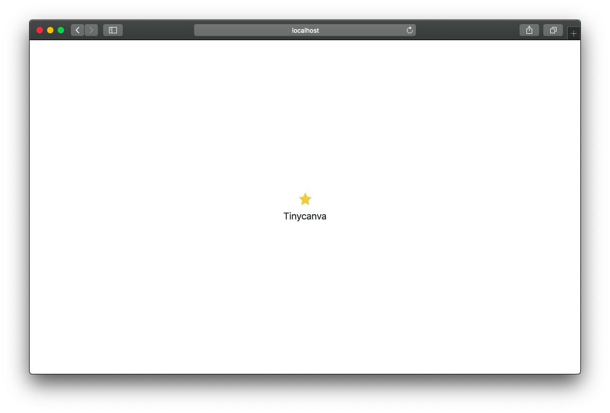

# UI and CSS Setup
For this course, we'll be using a combination of Blueprint UI Framework and Tailwind CSS. Blueprint (or BlueprintJS) is a set of React UI components like Modals, Inputs, Buttons, etc. Tailwind CSS is a functional (or atomic) CSS framework that exposes utility classes that can be mixed to create responsive UIs.

Both BlueprintJS and Tailwind need a set of CSS classes to function. In combination, this leads to heavy CSS import. For development use, a large bundle size doesn't matter. For production use, you can easily minify CSS using any standard minifier, like [PurgeCSS](https://purgecss.com/). This part is independent of Clojure.

## Install BlueprintJS
The [Blueprint UI framework](https://blueprintjs.com/) is managed by [Palantir Technologies](https://www.palantir.com/). Blueprint is open-sourced under [Apache 2.0 License](https://choosealicense.com/licenses/apache-2.0/) and is free for commercial use.

It is distributed as `@blueprintjs/core` package:
```bash
yarn add @blueprintjs/core
# or npm install @blueprintjs/core
```
This installs the React components, but you still need to import CSS files to get the styles working.

:::important

At the time of this writing, the latest version of `@blueprintjs/icons`, a package that `@blueprintjs/core` depends on, throws a parsing error in Google Closure Compiler. If you see an `Exception parsing "~/tinycanva/node_modules/@blueprintjs/icons/lib/cjs/generated/iconContents.js"`, you can fix it by installing an older version of `@blueprintjs/icons` explicitly:

```bash
yarn add @blueprintjs/icons@3.18.0
# or npm install @blueprintjs/icons@3.18.0 --save-dev
```

This section will be updated when the bug is resolved.
:::

## Install Tailwind
Tailwind is an atomic CSS library. It ships thousands of utility classes. For example: class names `m-0`, `m-1`, ... `m-n` specify the style `margin:n rem`.

Instead of adding a class to an element and styling that class, you add a class to the element for each style you want to apply. For example, if you have a `div` and you'd like to set a border and padding on it, you can add the classes `border-solid p-2` to it. You can change the border color using the class `border-black` (or pick from a variety of other colors). We recommend this [30-minute crash course](https://www.youtube.com/watch?v=UBOj6rqRUME) by [Traversy Media](https://www.youtube.com/channel/UC29ju8bIPH5as8OGnQzwJyA) if you'd like to learn more about Tailwind.

Tailwind ships as an NPM package with some added dependencies and scripts for customization. We need the `tailwindcss` package:

```bash
yarn add tailwindcss --dev
# npm install --save-dev tailwindcss
```

To customize Tailwind with brand colors, we need to create a configuration file in the root directory (the directory containing `package.json`). This can be done using the `tailwindcss` binary that ships with the package:
```bash
yarn tailwindcss init
# or npx tailwindcss init
```

This will create a file called `tailwind.config.js` in the root directory. With this configuration, you can change the default fonts, colors, margin sizes, etc.

## Install PostCSS
PostCSS allows us to bundle, minify, and purify (remove unused classes) CSS from a variety of CSS sources like Saas, Less, Stylus, etc. It ships with a plugin eco-system to enhance various aspects of writing CSS.

We'll use PostCSS to compile Blueprint and Tailwind CSS styles. In our setup, we don't need to write any custom CSS as we will rely on Tailwind (and some inline styles). But if you need to write custom CSS, you can bundle and process that too with PostCSS:

```bash
yarn add postcss-cli postcss-import
```

We also need `postcss.config.js` file to configure PostCSS plugins. Create this file in the project root and add the following configuration to it:

{lang=javascript}
<<[tinycanva/postcss.config.js](./protected/source_code/tinycanva/postcss.config.js)

- The `postcss-import` plugin inlines import statements, ie takes the content of the imported file and sticks at the place it was imported, essentially leading to one compiled file
- The `tailwindcss` plugin gives access to TailwindCSS files and configuration
- The `autoprefixer` plugin automatically adds browser-specific prefixes like `moz-` `webkit-` to styles that need it

## Create a CSS source directory
We will store CSS files in the `src/css` folder. Then create a mechanism to process these files and import them in `public/index.html`:

```bash
mkdir src/css
```

## Create Blueprint CSS source
BlueprintJS requires three CSS files to function. We will create `src/css/blueprint.css` to import these files. You can also configure PostCSS to inline the contents of these files leading to one compiled CSS file:

```bash
touch src/css/blueprint.css
```

Then populate it with the following content:

{lang=css}
<<[tinycanva/src/css/blueprint.css](./protected/source_code/tinycanva/src/css/blueprint.css)

These are the styles required by Blueprint to function. The styles imported in this file are present in the `node_modules` directory. The `postcss-import` plugin automatically resolves the path to the respective `node_modules` path.

## Create TailwindCSS source
We need to repeat the same procedure for Tailwind CSS files:
```bash
touch src/css/tailwind.css
```
Then import the required Tailwind files:

{lang=css}
<<[tinycanva/src/css/tailwind.css](./protected/source_code/tinycanva/src/css/tailwind.css)
The resolution of Tailwind files is handled by the `tailwindcss` plugin (configured in `postcss.config.js`).

## Create custom CSS source (optional)
You can create as many stylesheets in this directory as you wish. We'll setup PostCSS to compile all CSS files in this directory. We'll create one file called `app.css`:

```bash
touch src/css/app.css
```

## Compile source CSS using PostCSS
We can use the PostCSS CLI to compile all CSS source files to the `public` directory:

```bash
yarn postcss src/css/*.css --dir public/css
```

This takes all the CSS files in the `src/css` directory, compiles them, and moves them to the `public/css` folder. The `--dir` flag is used to specify the output directory.

If you run this command, you should see a CSS file in `public/css` directory for every file in `src/css` directory:
```bash
$ du -sh public/css/*
272K	public/css/blueprint.css
 84K	public/css/blueprint.css.map
  0B	public/css/style.css
  0B	public/css/app.css
2.4M	public/css/tailwind.css
```

The `style.css` was created by `create-cljs-app` and can safely be deleted. Notice the large size of `tailwind.css`. This is due to thousands of unused classes. With production optimizations, this can be reduced to a few KiloBytes.

## Create NPM script to compile CSS
To make the compilation process user friendly, we can add the command we used to NPM scripts in `package.json`:

{lang=javascript,crop-start-line=7,crop-end-line=7}
<<[tinycanva/package.json](./protected/source_code/tinycanva/package.json)

We can now compile CSS using the command `yarn build:css`.

### PostCSS watch mode
In the future, if you decide to not use Tailwind, and write custom styles, you can configure PostCSS to recompile each time a source stylesheet changes. This can be achieved by running PostCSS in watch mode by adding `-w` or `--watch` to the end of the build command:

```bash
yarn postcss src/css/*.css --dir public/css --watch
```

Then keep this watcher running in a separate terminal. Since we plan to use Tailwind and not write custom stylesheets, we will not need the `--watch` flag.

## Import compiled CSS to `index.html`
The last step of the chain is to include the compiled CSS `index.html` file. You might notice that `style.css` is imported already. This `link` was created by `create-cljs-app` and can be deleted safely.

Then, we need to add a `link` for every compiled CSS file:

{lang=html,crop-start-line=7,crop-end-line=9}
<<[tinycanva/public/index.html](./protected/source_code/tinycanva/public/index.html)

If you create more CSS files in the future, make sure to import them here.

## Test installation
Both Blueprint and Tailwind are now setup. We can test it by creating a new component in `app.core` namespace and rendering it on the `/test-ui` `Route`:

### Import `Button` and `Intent` from BlueprintJS
We'll create a component that renders a Blueprint Icon, for that we need to import it first:

{lang=clojure,crop-start-line=5,crop-end-line=5}
<<[tinycanva/src/app/core.cljs](./protected/source_code/tinycanva/src/app/core.cljs)

The [documentation](https://blueprintjs.com/docs/#core/components/icon) and [list of available icons](https://blueprintjs.com/docs/#icons) for this component can be found at the official site.

### Test component using Tailwind and Blueprint
We can create the component that renders a Blueprint button and also uses some utility classes from Tailwind in `app.core`:

{lang=clojure,crop-start-line=12,crop-end-line=17}
<<[tinycanva/src/app/core.cljs](./protected/source_code/tinycanva/src/app/core.cljs)

The `:>` convenience method is used to render `Icon` (a React component) inside Reagent.

The classes attached to `:div` and `Icon` component are Tailwind classes:
- [w-full](https://tailwindcss.com/docs/width#fluid-width): Sets the width of element to 100%
- [h-screen](https://tailwindcss.com/docs/height#screen-height): Sets the height of the element to `100vh`
- `flex`: Is equivalent to `display:flex`
- `text-center`, `text-lg`, and `text-yellow-500` center the text, make it large, and set its color to a shade of yellow respectively. Blueprint icons are rendered as SVGs and changing the CSS text color changes the color of the SVG
- `mb-2` and `m-auto` set the margin-bottom to scale 2 and auto respectively

As you use these classes, they will make their way to your muscle memory. But you will need to refer to the docs initially.

### Render component on `test-ui` path
Since we have a router in place already, we can create a route for this component:

{lang=clojure,crop-start-line=27,crop-end-line=27}
<<[tinycanva/src/app/core.cljs](./protected/source_code/tinycanva/src/app/core.cljs)

### Check browser
If everything worked `http://localhost:3000/test-ui` should show a yellow star and "Tinycanva":



## Conclusion
In this chapter, we explored the integration of the CLJS ecosystem with the JS ecosystem. We set up a UI library and a CSS library and tested that our setup works.

Both [Blueprint](https://blueprintjs.com) and [Tailwind](https://tailwindcss.com) have excellent documentation. Later chapters might use a component or a CSS class without explaining it. To be on the same page, make sure you refer to the relevant documentation.

