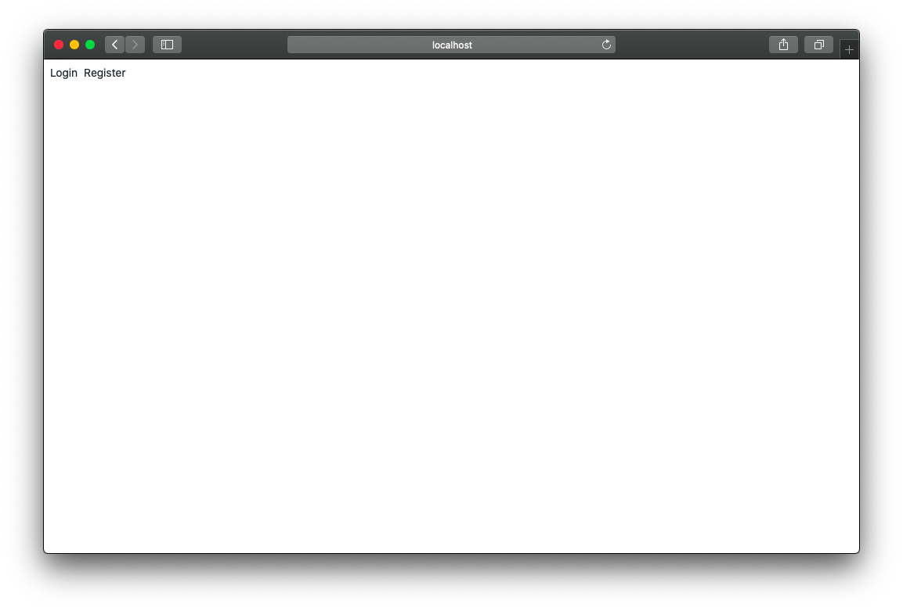
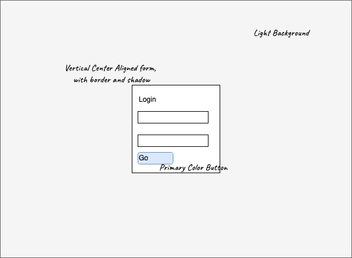
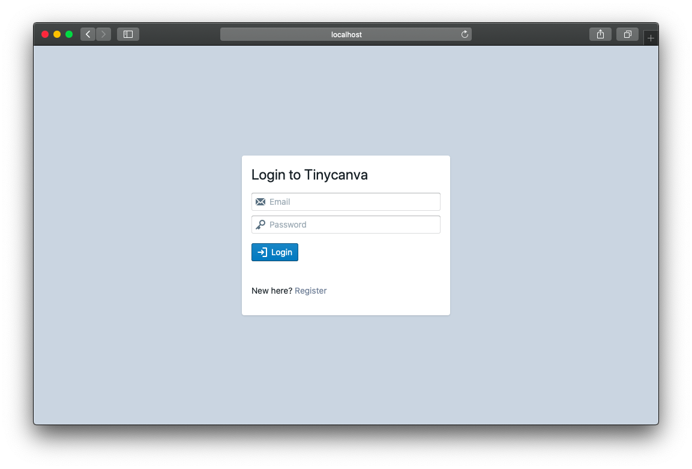

# App Structure and Authentication UI
The structure we are going to use for our app is largely influenced by React Router. For every route path, we are going to have a dedicated namespace. React routes grow in the shape of trees, our namespaces will grow similarly. Here is a table of possible routes and the respective namespace:

| Path           | Namespace                            |
|----------------|--------------------------------------|
| `/`            | app.pages.index                      |
| `/login`       | app.pages.login                      |
| `/graphics`    | app.pages.graphics                   |
| `/foo/bar`     | app.pages.foo.bar                    |
| `/baz/:id`     | app.baz.detail or app.baz.id         |
| `/baz/:id/biz` | app.baz.detail.biz or app.baz.id.biz |

This structure is inspired by [Fractal Structure for React Apps](https://hackernoon.com/fractal-a-react-app-structure-for-infinite-scale-4dab943092af).
Notice how the namespace graph and the route graph mirror each other. This structure is opinionated and made to fit React Router. Just like the Reframe structure, this is just a suggestion.

For smaller apps, like ours, it also makes sense to have just a single namespace called `app.views` with all view related logic. Feel free to change things up as you get a hang of it.

## Index Route
In real-world apps, the index page is generally a landing page with various links including links to Register and Login. In real life, it's also probably a static page. In our simple application, however, the index page simply points to the login and register page.

Let's create this component with Hiccup and Tailwind CSS:

{lang=clojure}
<<[tinycanva/src/app/pages/index.cljs](./protected/source_code/tinycanva/src/app/pages/index.cljs)

The classes `m-2` and `mr-2` specify margin all and margin right at scale 2. The `Link` component is a React component adapted to Reagent using `:>` shorthand. To tie this component to the `/` index route, we need to update the `app.core/root-router`:

{lang=clojure,crop-start-line=17,crop-end-line=17}
<<[tinycanva/src/app/core.cljs](./protected/source_code/tinycanva/src/app/core.cljs)

And require the `app.pages.index` namespace in `app.core`:

{lang=clojure,crop-start-line=4,crop-end-line=4}
<<[tinycanva/src/app/core.cljs](./protected/source_code/tinycanva/src/app/core.cljs)

With the route connected to the component, you should see a humble landing page if you visit `http://localhost:3000`.

You might have some remnants of the `test-ui` component in `app.core` namespace. These can be safely removed.

## Login Route
For this application, we'll be using Firebase Auth with email and password. The login form has two input fields: `email` and `password`. And a button to submit the form. Blueprint's [`InputGroup`](https://blueprintjs.com/docs/#core/components/text-inputs.input-group) and [`Button`](https://blueprintjs.com/docs/#core/components/button) components will be handy.

To store the state of the input, we'll use a ratom. Since the Login component is mounted at `/login`, we need to create the namespace `app.pages.login`:

{lang=clojure,crop-start-line=1,crop-end-line=7}
<<[tinycanva/src/app/pages/login.cljs](./protected/source_code/tinycanva/src/app/pages/login.cljs)

Tailwind CSS makes it easy to style components. Especially if we have a design in place. We created this wireframe for you to try and create the component yourself.

Take some time and try to define the `app.pages.login/page` component using `InputGroup` and `Button`. When done, you can match your code against ours:

{lang=clojure,crop-start-line=9,crop-end-line=35}
<<[tinycanva/src/app/pages/login.cljs](./protected/source_code/tinycanva/src/app/pages/login.cljs)

This is perhaps the largest piece of Clojure code we have written so far. Let's break it down using numbers marked in comments:
1. The `let` binding derefs state ratom, exposing the current values of `email` and `password`
2. The top-level `:div`:
   - `w-full` sets the width to `100%`
   - `h-screen` sets the height to `100vh`
   - `flex` sets the display to flexbox
   - `bg-gray-400` sets the background color to a shade of gray
3. The form holder `:div`
   - Classes `w-2/3` and `md:w-1/3` can be read as "two thirds width on mobile devices and one third width on medium screen and larger devices"
   - `m-auto` sets the vertical and horizontal margin to auto, centering the `div`
   - `bg-white`, `px-4`, `rounded` and `shadow` add respective styles
4. The email input is an instance of Blueprint's `InputGroup`. It accepts a value from state ratom and swaps the value in `:onChange` handler
   - `:>` is the shorthand to adapt React components to Reagent components
   - The `:leftIcon` prop lets us define an icon from the [list of inbuilt icons](https://blueprintjs.com/docs/#icons)
5. The submit button has an empty `:onClick` handler because we need to setup Firebase before this form can work
6. We have added a `Link` to the `/register` route

If you find it hard to grasp any point listed above, we recommend re-reading the chapter on Reagent where we walked through each concept in detail.

To get this route working, we need to import the `app.pages.login` namespace and update the `app.core/root-router` component:

{lang=clojure,crop-start-line=5,crop-end-line=5}
<<[tinycanva/src/app/core.cljs](./protected/source_code/tinycanva/src/app/core.cljs)
{lang=clojure,crop-start-line=18,crop-end-line=18}
<<[tinycanva/src/app/core.cljs](./protected/source_code/tinycanva/src/app/core.cljs)

If everything went fine, you should see the login component on `http://localhost:3000/login`

## The magic of REPL
Do you remember the time when we connected our editor to the `node-script` runtime? And how we were able to execute commands in our editor and see inline results.

The browser is also a runtime and we can connect our editor to it. You might need to refresh your memory on how to [connect to NREPL depending on your editor](/courses/tinycanva-clojure-for-react-developers/language-semantics-nrepl/#connecting-your-editor-to-the-nrepl).

If you are wondering why would you do it? Just connect to the NREPL and create a rich comment at the bottom of `app.pages.login` namespace:

{lang=clojure,crop-start-line=37,crop-end-line=39}
<<[tinycanva/src/app/pages/login.cljs](./protected/source_code/tinycanva/src/app/pages/login.cljs)

When you evaluate the `reset!` function, the ratom updates, and the component is re-rendered. My mind was blown the first time I saw this happen.

Now, you can document your development process in a comment, that gets committed to git. You can interact with your app without filling forms. You can press the submit button, without using your mouse, inspect state and objects, and a lot more. This leads to a shorter feedback cycle and faster development.

You can practically emulate the browser's console, right inside your editor. Try `(js/alert :woah)`.

## Register Route
This route, for now, is a replica of the Login route. The only difference being the namespace `app.pages.register` and labels.

We have included the source code of this route but will skip talking about it. We suggest you set it up so we can use it later. Once done, you should have the register component working on `http://localhost:3000/register`.

## Conclusion
In this chapter, we studied the app structuring convention following the Fractal structure and created UI components for Login, Register, and Index routes.

We also saw how the REPL integrates with the DOM and lets us perform actions without leaving the editor, leading to a fast feedback loop.

