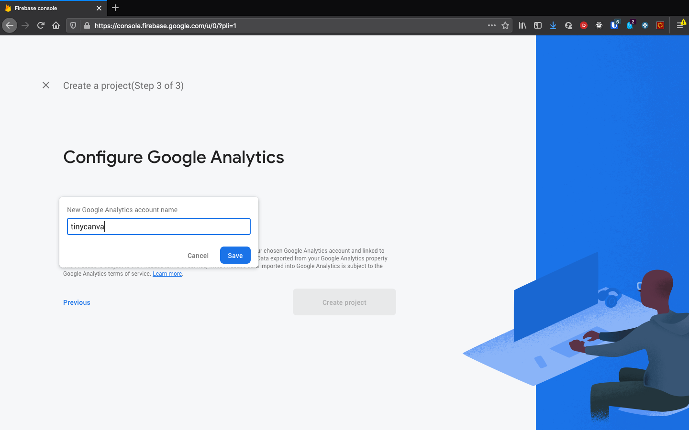

# Firebase Project Setup

Firebase is Google's PaaS offering with many useful features like auth, real-time no-sql database, analytics, and more. We'll be using Firebase to authenticate our users, and for saving graphics data in the real-time database.

The Auth offering is practically free with some limits (that don't apply at the Tinycanva scale). Firebase Auth also lets us use multiple auth mechanisms: email/password, Facebook, Twitter, etc. using one common interface.

Firebase comes with SDKs for Java, JavaScript, and many other languages. We are in luck since ClojureScript can interop natively with NPM packages.

## Anatomy of a Firebase project

The Firebase project is the root container for an application. Each project has a database, a set of users, analytics, storage, and other features.

Each project can further have multiple clients. For example, the Tinycanva project might have a web app client, and iOs app client, and an Android app client. All clients share the same underlying infra (ie. same database).

## Create the project

For working on Tinycanva, you need to [signup](https://firebase.google.com) and create a new project. The free (Spark) plan will suffice for our needs.

After signing up, visit the [console](https://console.firebase.google.com) and create a project:


This will open a project creation wizard. Walkthrough the wizard and set the name of the project (suggestion: tinycanva).


Next up, we need to decide if we need analytics or not. In the screenshot below, we have enabled it. In case you don't need them, turn the switch off. We are not going to use analytics further in this course, so it doesn't matter.


If you choose to enable analytics, you'll be asked to connect or create a new analytics account. We have created a new account called `tinycanva`:



After accepting some terms of services, your project will finally be ready to work on:


## Enable email/password authentication

You'll be redirected to the project page on successful project creation. In the `Authentication` section in the left sidebar, click on the `Sign-in Methods` tab. You'll be presented with a list of available methods.

Next, click on `Email/Password` authentication and enable it. You can add other methods, but you'll need more configuration. For example, sign in with Facebook requires a registered Facebook app id.


For now, we'll only enable `Email/Password` authentication.

## Create a test user

We suggest using different Firebase projects for different environments. In real life, you would have multiple projects: `tinycanva-dev`, `tinyvanva-qa`, `tinycanva-prod`, etc. We can assume this project to be the development version and it's helpful to have some test users.

In the `Authentication > Users` section, click `Add User` to create a new test user. You can set the credentials to your liking:


## Create web client

The last thing on our todo list is the creation of a client. On the `Project Overview` page, click the `Add App` button.


Each client (ios, web, etc) has its app and personal set of credentials. Since we are building a web app, we are going to name this `web`, feel free to choose any other name you prefer. After accepting the terms of services, you'll be presented with some boilerplate setup code. Save your configuration credentials somewhere, we'll use them soon:


## Install JS SDK

Firebase SDK ships as `firebase` on NPM:

```bash
yarn add firebase
```

It ships as a base object and a collection of modules. We'll set it up in the next chapter.

## Conclusion

In this chapter, we set up a Firebase project, created an app, and saved our app credentials. We also installed the SDK via NPM and are now ready to set it up.

