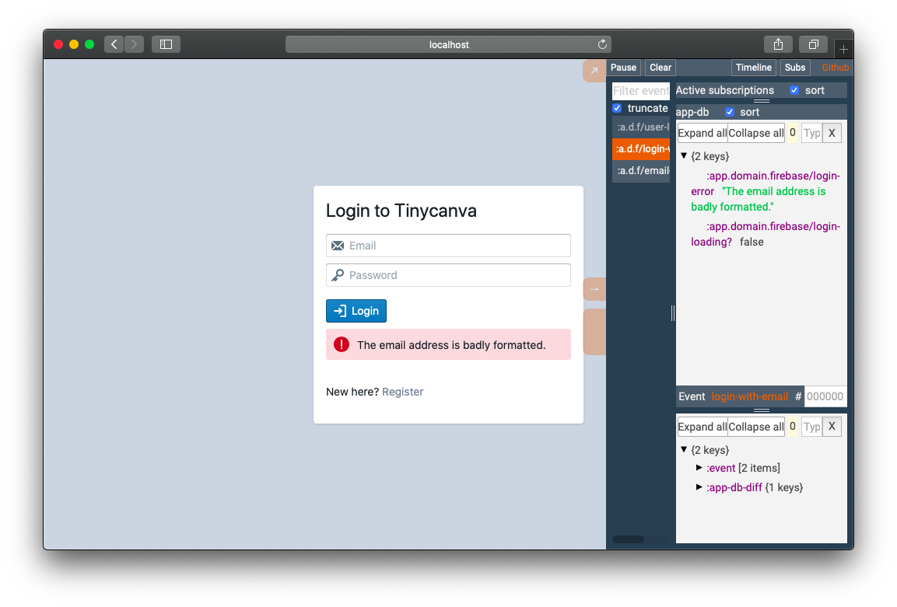

# Auth Subscriptions and Container Components
We dispatched an event, created an event handler, executed the login side effect, and handled errors. All these actions caused the `app-db` to change. Next, we need to update our UI to reflect changes made to `app-db`.

## Subscriptions
Reframe subscriptions reactive views on top of the `app-db`. Fancy terms, but simple idea. A subscription lets you watch a subset of `app-db`, and cause any subscribed component to re-render when the watched set changes.

## Login loading subscription
A visual indicator for long-running tasks is a good UX practice. We added a `:a.d.f/login-loading?` flag and can show a visual indicator by subscribing to this state.

`:a.d.f` is short for `:app.domain.firebase` namespace.

A subscription can be created using the `re-frame.core/reg-sub` method. This function accepts a subscription id and a handler function. This handler function is called with the `app-db` as the first argument and the subscription vector as the second argument.

To show a login indicator, we need two logical pieces:
- A registered subscription that pulls out the loading flag from `app-db`
- A subscribed component, that listens to this subscription

Let's register the subscription. The code for this will goto `app.domain.firebase` namespace. An alternate convention is to have an `app.subs` namespace to handle all subscriptions. We'll stick to our domain strategy, but feel free to experiment:

{lang=clojure,crop-start-line=68,crop-end-line=71}
<<[tinycanva/src/app/domain/firebase.cljs](./protected/source_code/tinycanva/src/app/domain/firebase.cljs)

After registration, any component can subscribe to this subscription.

## Login loading subscriber
The component rendered at `/login` needs this information to show a loading indicator. Blueprint's `Button` component accepts a prop `:loading`, which when set to `true`, disables the button and shows a spinner animation.

The `reframe.core/subscribe` method lets us hook a component to a subscription. It returns an `atom`. Let's update the `app.pages.login/page` component to be subscribed. Add the subscription to the `let` binding, just next to `email` and `password`:

{lang=clojure,crop-start-line=14,crop-end-line=14}
<<[tinycanva/src/app/pages/login.cljs](./protected/source_code/tinycanva/src/app/pages/login.cljs)

This subscription didn't require any arguments. But arguments can be passed as additional elements to vector supplied to `rf/subscribe` and can be captured in the handler `(rf/subscribe :sub-id (fn [sub-id arg1 arg2]))`. The second argument, that we ignored using an `_` underscore in the subscription above, will be this vector. Similar to event handlers.

The last step is to pass `login-loading?` as a prop to the `Button` component:

{lang=clojure,crop-start-line=32,crop-end-line=35}
<<[tinycanva/src/app/pages/login.cljs](./protected/source_code/tinycanva/src/app/pages/login.cljs)

We also suggest adding a `(prn ::> login-loading?)` statement to the top of your component, while you are testing this manually, so you get a log statement in your console.

## Test the system
We have finished the loop! If you now click the button on the login page, the data in the input fields will be sent to Firebase. And you should at least see a login indicator. Click the button to see if things work. You can also check the console because the request might execute too fast and the UI might not re-render with the indicator.

## Subscribe to login errors
In the last chapter, we configured the `:firebase/email-auth` effect to catch and dispatch `:a.d.f/email-auth-error` event in case of errors. The handler for this event pulls out the `message` property from error object and saves it in `app-db`. But this error should be visible to the user. Let's create a subscription in `app.domain.firebase`:

{lang=clojure,crop-start-line=73,crop-end-line=75}
<<[tinycanva/src/app/domain/firebase.cljs](./protected/source_code/tinycanva/src/app/domain/firebase.cljs)

This time we used the shorthand syntax for inline function. `%1` denotes the first argument. Note that the subscription id and the `app-db` key is the same for both our subscriptions. This is just a coincidence. The subscription id can be anything.

We need the `app.pages.login/page` component to subscribe to this subscription. This subscription should be inside the `let` binding:

{lang=clojure,crop-start-line=15,crop-end-line=15}
<<[tinycanva/src/app/pages/login.cljs](./protected/source_code/tinycanva/src/app/pages/login.cljs)

Finally, we need to show the error message to the user. Blueprint's `Callout` component is ideal for our use case. We can add the error just below the `Button`:

{lang=clojure,crop-start-line=38,crop-end-line=40}
<<[tinycanva/src/app/pages/login.cljs](./protected/source_code/tinycanva/src/app/pages/login.cljs)

- The login error is a string message (you can inspect JavaScript objects using `(js/console.log obj)`, this will print the object to your console)
- We show a `Callout` component, only `when` `login-error` is present

If you click the login button now, you should see an error.

The Refrisk dashboard lists the events that occurred and the progression of `app-db` overtime.

## Reframe loop recap
It took us three chapters to build this system. In terms of the mental model, we followed the following step:
- User fills the form, the state saved in a local ratom
- User clicks login button, a Reframe event is dispatched
- The event handler for the login event runs and sets the `login-loading?` flag to `true`. The handler also requests to run the custom Firebase auth effect
  - A component subscribes to `login-loading?` and re-renders the UI with a loading spinner
- In case of error, the loading flag is set to false, and the error is set in `app-db`
  - A subscribed component re-renders with the error message
- If the login is successful, the user is set in `app-db`, and the `login-loading?` flag is set to `false`

## Subscribe to login success
When a user authenticates successfully, the user is cached in `app-db`. This happens because `app.domain.firebase/observe-auth-state` function dispatches `:a.d.f/user-logged-in` event, which sets the users in `app-db`. We'll refer to the logged in user as `me`. Let's create a subscription to listen to `me`:

{lang=clojure,crop-start-line=63,crop-end-line=66}
<<[tinycanva/src/app/domain/firebase.cljs](./protected/source_code/tinycanva/src/app/domain/firebase.cljs)

But this is not enough. There are more cases to handle with a logged-in user:
- If a user successfully logs in, redirect to a private route
- If a user logged in, and she visits `/login`, redirect to the private route automatically
- If a user is not logged in, and tries to access a private route,  redirect to the login  page

We are going to handle these cases by creating two wrapper components: `auth/private` and `auth/public`.

Public routes like `/login` and `/register` will be wrapped in `auth/public` component. `auth/public` will subscribe to `:a.d.f/me`. If `me` is not `nil`, the component will redirect to a protected route.

All private routes will be wrapped in the `auth/private` component. This component will subscribe to the logged-in user in `app-db`. If at any point, the user in `app-db` becomes `nil`, the user will be redirected to the home page. We'll build these components in the next chapter.

