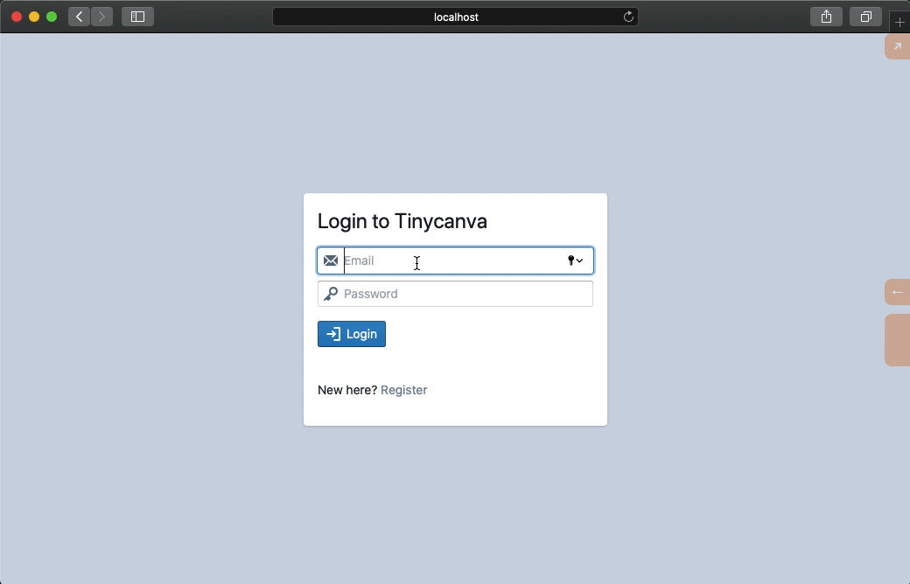
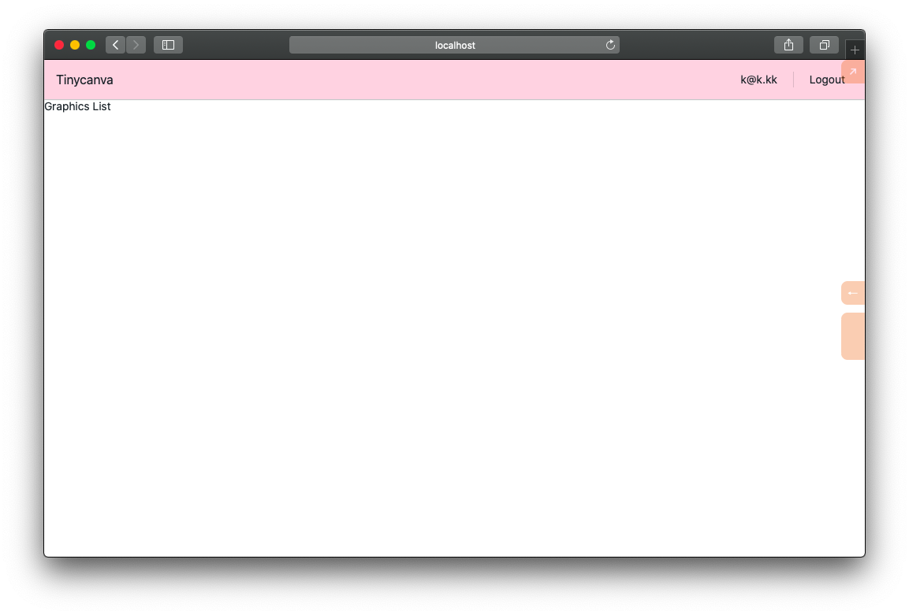
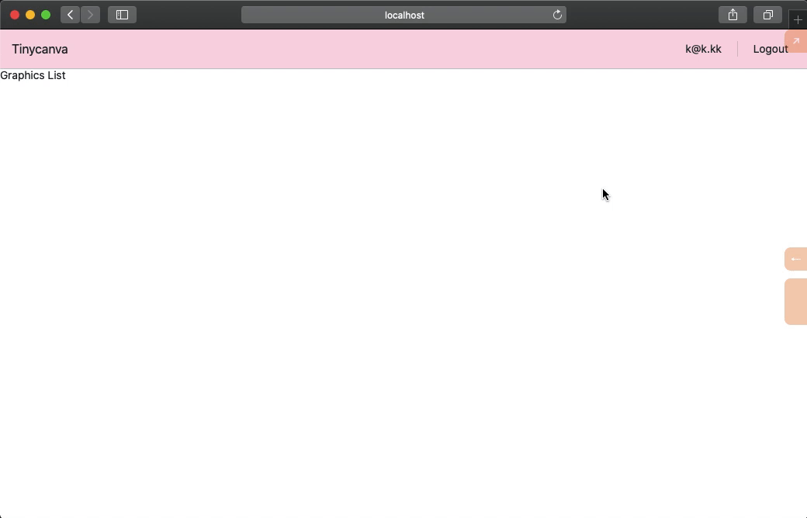
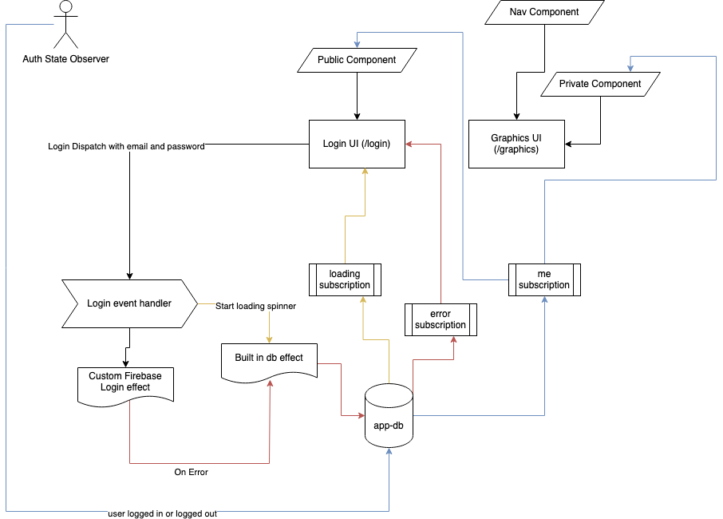

# Auth Containers
Our app has a `/graphics` route, that lists all the graphics a user has created. This will be our root private route, ie, a user will be redirected here as soon as she logs in.

For common components like Navigation, Auth Containers, Rich Text Editor's, etc, we'll use the `app.components.*` namespace. This gives us three top-level namespaces:
- `app.domain.*` for domain-specific functionality
- `app.pages.*` for top-level routes and
- `app.components.*` for shared components

We'd like to point out again that this is one way to do it. Feel free to experiment with structuring your apps.

## Public container
Let's define a `public` component `app.components.auth/public` that will wrap `/login` and `/register` route components.

The job of this component is to listen to `:a.d.f/me` and redirect the user to `/graphics` route as soon as she logs in. If the user is not logged in, it renders the children (ie. the login form):

{lang=clojure,crop-start-line=1,crop-end-line=11}
<<[tinycanva/src/app/components/auth.cljs](./protected/source_code/tinycanva/src/app/components/auth.cljs)

The `public` component subscribed to `:a.d.f/me`, defined in the last chapter, and it redirects to `/graphics` if a user is logged in.

The argument to the `public` function `children` should not be confused with `props.children`. This is a Reagent component. The `children` in this case is the vector of `divs` that make up the login page.

We use `& chidlren` to allow for multiple Hiccup forms like:

```clojure
[auth/public
	[:div "form 1"]
	[:div "form 2"]]
```

If  we used `children`  in place of `& children`, Reagent would render only the first form and ignore all others, ie. will only render `[:div "form 2"]` in the example above.

`:<>` is the shorthand for React Fragment. In React, a component can return only one form. Since we allow the children to be a list of forms, we wrap it in a Fragment so React doesn't complain. 

The `Redirect` component from React Router is used to perform the Redirect using a component.

If we wrap the `:a.p.login` component with `auth/public` after `:require`ing it, we will get redirected to `/graphics` on successful login:

{lang=clojure,crop-start-line=5,crop-end-line=5}
<<[tinycanva/src/app/pages/login.cljs](./protected/source_code/tinycanva/src/app/pages/login.cljs)

{lang=clojure,crop-start-line=12,crop-end-line=20}
<<[tinycanva/src/app/pages/login.cljs](./protected/source_code/tinycanva/src/app/pages/login.cljs)

Notice how all components are now wrapped under `auth/public`. The above example is truncated, you will have more lines of code in your component.

We [created a test user](/courses/courses/tinycanva-clojure-for-react-developers/tc-firebase/#create-a-test-user) while setting up Firebase. Try to login with the test credentials and you'd be redirected to `/graphics` route.



After logging in, if you try to visit `/login` by manually altering the URL, the app will redirect you to `/graphics`.

## Top Navigation and Logout UI
It's standard to have a top global nav with some details about the user and actions like settings, profile, and logout.

Since our users can log in now, let's make them feel at home by showing their email and a logout option. We'll use Blueprint's [`Navbar`](https://blueprintjs.com/docs/#core/components/navbar) component.

`Navbar` has support to align items to the left or right, add headings, dividers, and much more. We recommend checking the component props if you'd like to learn more.

Nav will be used throughout the application, ie. belongs to `app.components.nav` namespace. We are going to define `app.components.nav/top` component for top navigation. In an application that has multiple nav bars, multiple components can be defined in this namespace:

{lang=clojure}
<<[tinycanva/src/app/components/nav.cljs](./protected/source_code/tinycanva/src/app/components/nav.cljs)

- We subscribe to the logged-in user
- `bg-pink-200` sets the nav background to a shade of pink, you can try [other colors](https://tailwindcss.com/docs/background-color)
- `(.-Group Navbar)` is equal to `Navbar.Group`
- The `:align` prop helps align the Group to either left or right
- We render a `Navbar.Heading` in the left group and
- Two buttons in the right group
- The logout button dispatches `:a.d.f/logout` event which we haven't created yet

## Graphics Component
This `nav/top` will be rendered in all private routes. We have only one such route so far: `/graphics`. But it is configured to use the `placeholder` component. Let's create a component dedicated to this route. Since `/graphics` is a top level route, it's component will go to `app.pages.graphics` namespace:

{lang=clojure}
<<[tinycanva/src/app/pages/graphics.cljs](./protected/source_code/tinycanva/src/app/pages/graphics.cljs)

The graphics component renders the string `Graphics List` and the `nav/top` component. Also, note the `auth/private` component. It signifies that this component can only be accessed by a logged-in user. We have not created the `private` component yet.

## Private Component

The `private` component is more demanding than the `public` counterpart. With `public`, the component is visible by default, and redirect happens when the state changes.

With the `private` component, however, we first need to read the state and figure out if the user is logged in or not. This could be tricky as there are two ways to enter a private component:
1. Automatic redirect from `public` component, ie. the user is logged in for sure and present in `app-db`
2. Direct access by entering the URL into the browser (or refreshing the page while on the private route), ie. the user may or may not be logged in but we don't have any status in `app-db`.

We are in luck here because we call `observe-auth-state` as a part of our initialization process. This figures out if the user is logged in and dispatches `:a.d.f/user-logged-in` or `:a.d.f/user-logged-out` effect accordingly.

We can modify it to set a flag `:a.d.f/loading-from-cache?` on the first render. This will let us know if the user entered the `private` component directly, and we can show a loading indicator until the auth status of the user is determined. This flag can take three values:
- `nil` - We don't know the auth status
- `true` - We are figuring out the auth status
- `false` - The auth status is figured out

### Update `observe-auth-state` to set extra loading flag
We can `dispatch` and event to `set-loading-user-from-cache` flag:

{lang=clojure,crop-start-line=16,crop-end-line=23}
<<[tinycanva/src/app/domain/firebase.cljs](./protected/source_code/tinycanva/src/app/domain/firebase.cljs)

Since `observe-auth-state` is called exactly once when the app loads, we now have an indicator to know if a user is being loaded from the Firebase cache.

### Handle loading from cache event
We also need to handle this event:

{lang=clojure,crop-start-line=67,crop-end-line=70}
<<[tinycanva/src/app/domain/firebase.cljs](./protected/source_code/tinycanva/src/app/domain/firebase.cljs)


### Unset flag
When the app is ready and we have ascertained the auth status of the user, we need to set the loading flag to `false`. We can do this by updating the `::user-logged-in` and `::user-logged-out` event handlers:

{lang=clojure,crop-start-line=52,crop-end-line=55}
<<[tinycanva/src/app/domain/firebase.cljs](./protected/source_code/tinycanva/src/app/domain/firebase.cljs)

We explicitly set the flag to `false` instead of `dissoc`iating it because `dissoc` effectively sets the value to `nil`. But for us, `nil` is the starting value, ie. we don't know the auth status, `true` is the intermediate value, ie. we are figuring out the auth status and `false` is the conclusive value, ie. we have figured out the auth status.

We need to repeat the process for the logged out handler:

{lang=clojure,crop-start-line=62,crop-end-line=65}
<<[tinycanva/src/app/domain/firebase.cljs](./protected/source_code/tinycanva/src/app/domain/firebase.cljs)

Notice we changed the usage from `dissoc` to `assoc`.

### Loading from cache subscription
The `private` component needs to know about this the loading status to render, so let's expose it via a subscription:

{lang=clojure,crop-start-line=104,crop-end-line=106}
<<[tinycanva/src/app/domain/firebase.cljs](./protected/source_code/tinycanva/src/app/domain/firebase.cljs)

### Private component
With the subscription in place, we can now write our `private` component:

{lang=clojure,crop-start-line=13,crop-end-line=29}
<<[tinycanva/src/app/components/auth.cljs](./protected/source_code/tinycanva/src/app/components/auth.cljs)

Here we handled three cases:
1. We checked the state and didn't find a user and we looked into Firebase cache for a logged-in user (because `loading-from-cache?` is `false`), ie. we are sure that the user is not logged in - redirect to login
2. If we found a user in the state, we render the route
3. Other cases where the user doesn't exist, but the app might be in the process of reading from Firebase cache, we show a `Loading ...` message

### Connect graphics to `root-router`
We also need to connect this component by `require`ing this namespace in `app.core` and configuring the `root-router`:

{lang=clojure,crop-start-line=7,crop-end-line=7}
<<[tinycanva/src/app/core.cljs](./protected/source_code/tinycanva/src/app/core.cljs)

{lang=clojure,crop-start-line=26,crop-end-line=26}
<<[tinycanva/src/app/core.cljs](./protected/source_code/tinycanva/src/app/core.cljs)

### Test the private route
If you try to login with the route connected (or visit `http://localhost:3000/graphics` if you are already logged in), you'd see the component we created:



## Logout Event and Effect Handler
Clicking the logout button dispatches an event that we haven't registered yet. This event should call the stateful `firebase.signOut` function. Then the `user` should be removed from `app-db`. We already have the `observe-auth-state` which removes the user from `app-db` on logout. We only need to create an event and an effect handler to call the `signOut` function:

The event handler's job is to just return `:firebase/logout` fx without any parameters:

{lang=clojure,crop-start-line=57,crop-end-line=60}
<<[tinycanva/src/app/domain/firebase.cljs](./protected/source_code/tinycanva/src/app/domain/firebase.cljs)

Next, we need to register the custom effect `:firebase/logout` to call the signout function:

{lang=clojure,crop-start-line=82,crop-end-line=87}
<<[tinycanva/src/app/domain/firebase.cljs](./protected/source_code/tinycanva/src/app/domain/firebase.cljs)

This effect doesn't need to make any changes to the `app-db` as the `observe-auth-state` function is configured to do that job. We could have called this function directly in the event handler, but the convention is that event handlers should be pure.

Since we have already configured the `auth/private` function to redirect to the `/` index route when a user logs out, she will be redirected automatically:




## Conclusion

Over the last six chapters, we built an authentication system and implemented state management using Reframe. The following diagram gives a bird's eye view of the system:



- We start at the `/login` page by dispatching a login event
- The login event handler captures this event and starts the loading spinner by using the built-in db effect
- Loading Indicator
  - The db effect updates the value of the loading flag in `app-db`
  - A loading subscription listens to this value
  - The login page subscribes to this value and updates the button reactively
- Custom Firebase login effect
  - This effect calls the impure SDK method to log the user in, this could also have been a REST API call
  - On error, it saves the error using the built-in db effect
  - A subscription on this error listens and passes the error to the login component
  - On success, the global auth state observer is triggered. A success event could also have been triggered here, depending on your API
- Global State observer
  - Watches auth state and saves `me`, ie the logged-in user to db via the built-in db effect
  - A subscription on the effect is passed to private and public container components
  - These components redirect as the `me` state changes
- We skipped logout events and effects from this diagram. Logout calls a custom effect and auth state observer clears the user from db.

By this point, you should be comfortable with the directory structure and Reframe loop.


