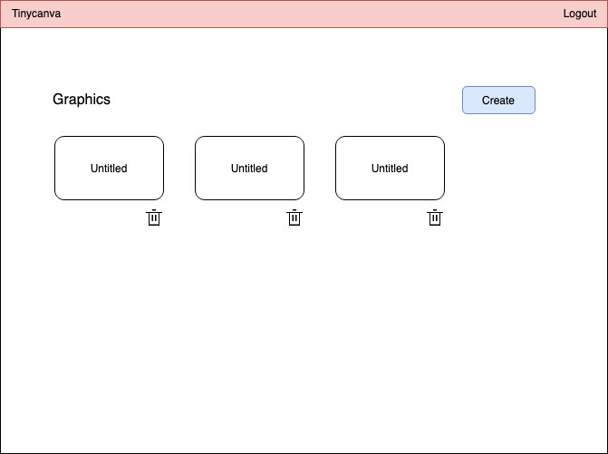
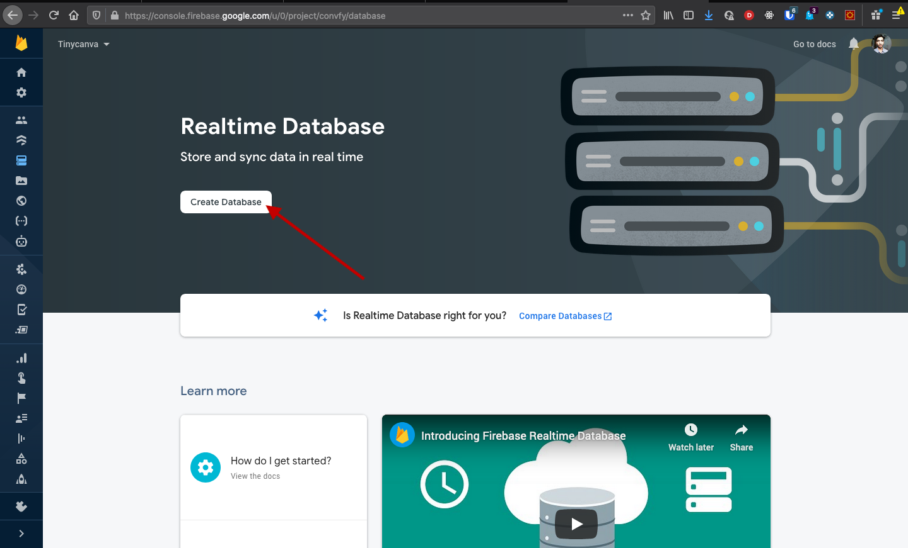
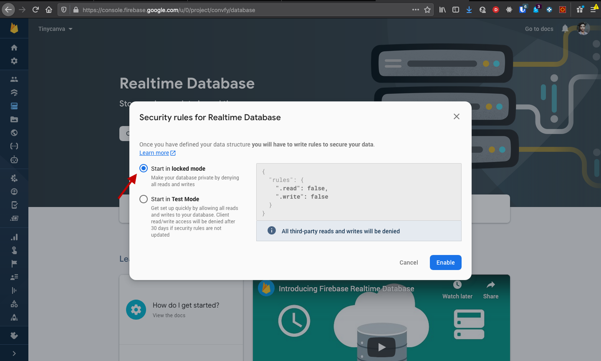

# Create Graphics
Canva helps you design posters, posts, etc. In our domain, we are going to call it a "graphic". A graphic has multiple entities attached to it: a name, a creation time, an owner, and the JSON representation of the graphic.

To build the editor, we are going to rely on [Fabric](http://fabricjs.com/). Fabric is an HTML Canvas manipulation library that we'll use to create graphics. The created graphic will be stored in the Firebase database in JSON format.

In this chapter, our focus will be on the creative aspect of the graphic entity. The actual editing will be handled in a future chapter.

We want the home page (`/graphics`) to show a grid of all graphics and a call to action to create a new graphic:



While building the Login system, we created the UI first, followed by the integration. For this chapter, we'll flip the process and build the integration first. We'll then use the REPL to manually test the integration.

## Setup Firebase Database
Firebase provides us a real-time NoSQL database that can be accessed via the SDK. Interacting with Firebase DB is conceptually similar to interacting with an API.

To get the ball rolling, we need to create a database. Login to the Firebase console, select your application, and create a new database in the `Realtime Database` section:



You'll be asked to choose between `Test Mode` and `Locked Mode`. `Test Mode` allows all logged in users to access all records. `Locked Mode` allows you to specify access control. We'll choose `Locked Mode`:



When done, you'll be redirected to the database page.

In Firebase DB, objects are stored in a tree shape. You can create nodes like `/graphics/$graphicId`. DB Rules let certain users access certain nodes. For our use case, we want a user to be able to access all graphics created by her. So, we'll save graphics under `/graphics/$userId/$graphicId` node and set a rule to let `$userId = x` access all nodes under `/graphics/x`. Click on the rules tab and replace the existing rule JSON with:

```javascript
{
  "rules": {
    "graphics": {
    	"$userId": {
            ".read": "$userId === auth.uid",
            ".write": "$userId === auth.uid"
      }
    }
  }
}
```

The configuration restricts the read and writes of all child nodes of `/graphics/userId` to the logged in user whose id is `userId`. Every user's id is maintained by Firebase auth.

If you'd like to learn more about Firebase permissions, we recommend reading this [StackOverflow question](https://stackoverflow.com/questions/21500946/firebase-how-to-list-user-specific-data) and the [official docs](https://firebase.google.com/docs/database/security/rules-conditions). In-depth knowledge of how Firebase permissions work is not required for this course.

### Firebase write node
Firebase DB can be visualised as a tree, with root node being `/`. To write to any node, we can use the `set` function:
```javascript
firebase.database().ref("/graphics/134/523")
	.set({"any": "valid json"})
	.then()
	.catch()
;
```

In the example above, we wrote a JS object to `/graphics/134/523`. If a node doesn't exist, it will be created.

### Firebase write lists
Assume our use case where a user can have multiple graphics. For the rules to work we need to make sure that all user related graphics are stored under `/graphics/$userId`. When we want to create a new graphic, we need Firebase to generate an id for us. This can be done using the `push` method:

```javascript
const userGraphics = firebase.database.ref("graphics/343"); // 343 is the uid of logged in user
const newGraphicRef = userGraphics.push(); // generates a new id at `/graphics/343/x`
newGraphicRef.set().then().catch(); //writes to `/graphics/343/x` node
```

### Firebase delete nodes
Any known node address can be deleted using the `remove` method. An address can also be deleted by using `set` with `null`:

```javascript
firebase.database().ref('/graphics/343')
	.remove()
	.then()
	.catch()
;
```
This should give us a good reference for writing our side effects.

## Creating Graphics
When the `Create New` button is pressed, we want to create a new graphic named `Untitled` and persist it to Firebase DB. On successful creation, we will redirect the user to the editor page, where they could edit the Canvas. We have not created this page yet.

### Dispatch Event
The UI button will dispatch an event to create a graphic. But since we don't have a UI yet, we can dispatch this event in a Rich comment. We know that the UI will be written in `app.pages.graphics` namespace, so we can add this `dispatch` to that file:

{lang=clojure,crop-start-line=13,crop-end-line=13}
<<[tinycanva/src/app/pages/graphics.cljs](./protected/source_code/tinycanva/src/app/pages/graphics.cljs)

Make sure that Reframe dependency is `:require`d in this namespace. Also, ensure that your wrap this dispatch in a `comment` block.

Now with the nREPL running, we can evaluate the dispatch and see that no handler is registered for the `:a.d.f/create-graphic` event.

### Event Handler
The next step is to handle the dispatched event using a pure function and returning a map of side effects. This handler will reside in `:a.d.f` namespace.

It's always a good idea to analyze what we want to happen when the event is dispatched. The purpose of this dispatch is to:
1. Set a loading indicator in `app-db` when graphic creation starts
2. Create a new graphic in Firebase DB
3. Set an error in `app-db` if creation fails
4. Unset error and loading status in `app-db` if creation is successful.

Step 2 is a side effect and steps 3 and 4 are dependant on the result of the side effect.  This also tells us that the event handler is only responsible for step 1 and 2. With this roadmap, let's write the handler:

{lang=clojure,crop-start-line=63,crop-end-line=71}
<<[tinycanva/src/app/domain/firebase.cljs](./protected/source_code/tinycanva/src/app/domain/firebase.cljs)

- `rf/reg-event-fx` is used to register an event that can call custom side-effects
- The id of the event is `::create-graphic`, ie. `:app.domain.firebase/create-graphic`
- The handler function receives a `cofx` map, that we destructured to pull out `db`
- `::creating-graphic?` flag will be set to `true` when the `db`  effect is evaluated, this will be helpful to show a loading indicator
- The handler returns a map with a custom side effect `:firebase/add-to-list` (which we haven't created yet)
  - The `add-to-list` effect is a generic effect that can be used to add a child to any node in the database
  - In our example, we want to write data as a child of the `/graphics/$userId` node
  - The `$userId` can be fetched from cache `(-> db ::user :uid)`. We stored the user in `app-db` during authentication
  - We also specify the `:data` to write as a child of this node. Since this effect can be called by other event handlers, it is a good idea to accept data to write as a parameter
  - We then specify events to dispatch in case of error or success, more on this later

### Effect Handler
All apps consist of multiple domain entities. The `:firebase/add-to-list` effect is designed to be generic and can be used to write any entity. The job of this effect is to:
1. Append a child to a node
2. Make an effect full call to Firebase to auto-generate new child node
3. Make the effectful call to Firebase and write to the newly generated node
4. Dispatch the `on-error` event in case of errors
5. Dispatch the `on-success` event in case of success

{lang=clojure,crop-start-line=103,crop-end-line=115}
<<[tinycanva/src/app/domain/firebase.cljs](./protected/source_code/tinycanva/src/app/domain/firebase.cljs)

- The custom effect expects `node`, `data`, `on-error` and `on-success` as parameters
- It creates a `ref`erence to the desired `node`
- Then `.push`es a `new-entry` on to that `node`, ie. adds a child
- Finally writes the data to the newly generated node using the `.set` function
- If the write was successful, the `on-success` event is dispatched with the `new-entry`
  - `on-success` parameter was a vector `[::create-graphic-success]`
  - `conj` adds to the end of the vector `[::create-graphic-success new-entry]`
  - `dispatch` is the regular Reframe dispatch
- Similarly `on-error` is dispatched with the error
  - the shorthand form of inline function: `#(rf/dispatch (conj on-error %))` can also be used


### Error and Success Event handlers
The error event in our case writes and error to `app-db`. The success event unsets this error. Both events unset the loading indicator:


{lang=clojure,crop-start-line=73,crop-end-line=84}
<<[tinycanva/src/app/domain/firebase.cljs](./protected/source_code/tinycanva/src/app/domain/firebase.cljs)

We used `reg-event-db` instead of `reg-event-fx` because only the `db` effect is required.

### Test creation
Now if you inline evaluate the `dispatch` statement again, a new graphic will be created in Firebase. You should also see the events in Refrisk.

## Conclusion
In this chapter, we integrated Reframe with Firebase DB to create the "graphic" entity. We relied on the REPL to test the functionality without the UI. We also studied how Firebase DB stores entities.

In the next chapter, we'll extend this functionality to read and delete graphics.

