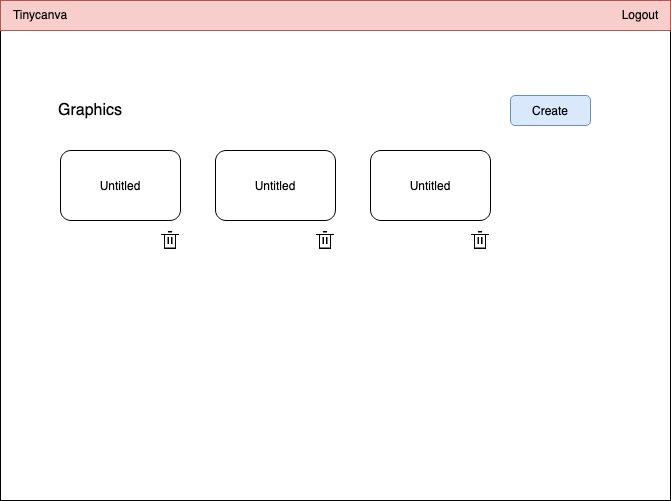
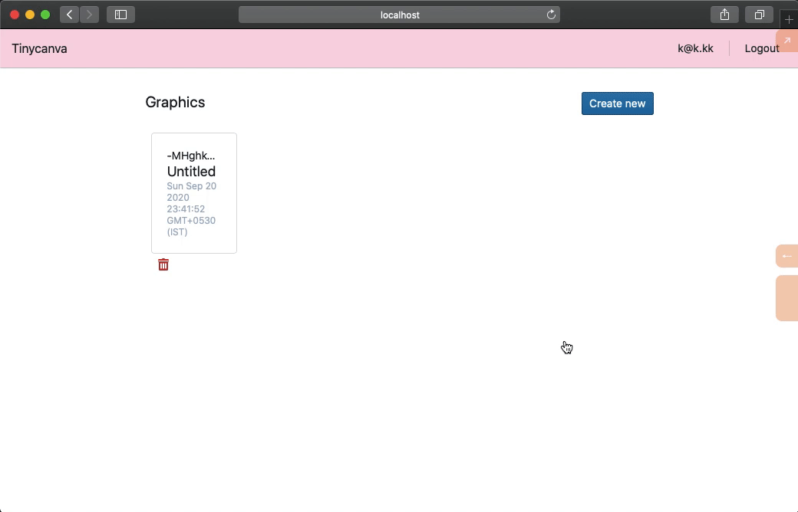

# Create, read and delete UI

With the functionality in place, we will now build the user interface for creating, reading, and deleting graphics. Here's the wireframe we started with:



## Title and create button

The page title "Graphics" and the create button can be clubbed into a component called `header`:

{lang=clojure,crop-start-line=8,crop-end-line=13}
<<[./tinycanva/src/app/pages/graphics.cljs](./protected/source_code/tinycanva/src/app/pages/graphics.cljs)

The `header` component renders a `:div` for the title and a Blueprint `Button`.

The CTA button dispatches the `:a.d.f/create-graphic` action, similar to what we did using the REPL. The component also subscribes to `:a.d.f/creating-graphic?` and uses the subscription value as `:loading` prop to the `Button` component. We have not written this subscription yet.

For this code to work, we need to `require` the necessary libraries:

{lang=clojure,crop-start-line=1,crop-end-line=6}
<<[./tinycanva/src/app/pages/graphics.cljs](./protected/source_code/tinycanva/src/app/pages/graphics.cljs)

### Subscription

We can pull the `::creating-graphic?` flag from `app-db` using a subscription in `a.d.firebase` namespace. We defined this flag when we wrote the handler for `::create-graphic` event:

{lang=clojure,crop-start-line=191,crop-end-line=193}
<<[./tinycanva/src/app/domain/firebase.cljs](./protected/source_code/tinycanva/src/app/domain/firebase.cljs)

If you find the usage of the key repetitive, you can use the [reframe-utils](https://gitlab.com/nikperic/reframe-utils) library. It provides a wrapper to Reframe API and allows for concise event handlers, effects, and subscriptions. With `reframe-utils`, the above subscription can be written as:

```clojure
(rfu/reg-basic-sub ::creating-graphics?)

;; which is equivalent to
(rfu/reg-basic-sub 
	::creating-graphics? ; sub id
	::creating-graphics? ; db key
	)

;; which is equivalent to
(rf/reg-sub
 ::creating-graphic?
 #(-> % ::creating-graphic?))
```

### Render header

We can add this component to `page` component for so it renders on `/graphics` route:

```clojure
(defn page []
  [auth/private
   [nav/top]
   [:div {:class "w-100 md:w-2/3 m-auto p-4"}
    [header]
	]])
```

If everything worked fine, you'd see the header component on the `/graphics` route. Clicking the `Create new` button will create a new graphic (and print to console):


## Graphics List

The job of this component is to fetch all graphics from Firebase and display them as a grid. The graphics can be fetched by dispatching the `:a.d.f/fetch-graphics` event, but this is a side effect!

The data should be fetched automatically when the component mounts. In modern React, this is achieved using the `useEffect` hook. In traditional React, the `component-did-mount` method is used to define the effects that need to be triggered when a component mounts.

To use the `useEffect` hook, we need to `reactify` Reagent components, ie. convert them to React components. This means losing access to ratoms. Since Reframe's `app-db` is just a Reagent atom under the hood, hooks don't play well with Reframe either.

It's a common approach in the Clojure frontend community to let the router handle mount interactions. This requires the developer to use a more bare-bones routing engine so the tweaks can be made. 

But since we are using React Router, we'll use Reagent's `create-class` method to create a class-based component. We'll then define a `component-did-mount` method, and dispatch the `::fetch-graphics` event in that method:

### Class based components

Unlike a functional Reagent component, a class based Reagent component is defined by passing a map to `reagent.core/create-class` method. This map accepts various key value pairs like:
- `:component-did-mount (fn [])` - Equivalent to React's `componentWillMount`
- `:display-name` - Name of the component for debugging and logging purposes
- `:reagent-render` - Equivalent to React's render

A full list of accepted key-value pairs can be found in the [official docs](https://reagent-project.github.io/docs/master/reagent.core.html#var-create-class).


### Graphics subscription

We want our `graphics-list` component to show a loading indicator when graphics are being fetched. Then render each graphic. Let's create the subscription that pulls the required data from `app-db`:

{lang=clojure,crop-start-line=195,crop-end-line=197}
<<[./tinycanva/src/app/domain/firebase.cljs](./protected/source_code/tinycanva/src/app/domain/firebase.cljs)

This will provide us with a map:

```clojure
{:app.domain.firebase/fetching-graphics? false
 :app.domain.firebase/graphics {:id1 {}
                                :id2 {}}
```

### Namespaced Destructuring of maps

So far we have destructured maps using `:keys` like so:

```clojure
(let [{:keys [a b]} {:a 1 :b 2}]
	(prn a b) ;; 12
	)
```

But what if your keys are namespaced, like in the map above?

We can destructure a map like :`{:ns/a 1 :ns/b 2}` using a slight variation to `:keys`:

```clojure
(let [{:ns/keys [a b]} {:ns/a 1 :ns/:b 2}]
	(prn a b) ;; 12
	)
```

By namespacing `:keys` keyword like `:ns/keys`, you can destructure keywords in the `:ns` namespace. If you are wondering why I brought this up right now, it's because we are going to use it for our `graphics-list` component.

### Graphics list component

This component will be a class based component. We will fetch graphics in the `:component-did-mount` function and render this list in `:reagent-render` method:

{lang=clojure,crop-start-line=27,crop-end-line=41}
<<[./tinycanva/src/app/pages/graphics.cljs](./protected/source_code/tinycanva/src/app/pages/graphics.cljs)

- `:component-did-mount` is called on first paint and dispatches the `:a.d.f/fetch-graphics` event
- `:reagent-render` accepts a function that returns a Hiccup form
- We used namespace destructuring in `let` bind to pull out the status of the loading indicator and map of graphics
- Blueprint's `Spinner` component is rendered when the graphics are loading (make sure this component is `require`d)
- Each graphic is looped using `for` and then rendered using the `graphic-card` component (we haven't created this yet)
- `^{:key id}` is the Reagent way of specifying keys to children of a list. Keys help React identify and track component state. You can learn more about keys at the [React official docs page](https://reactjs.org/docs/lists-and-keys.html#keys)

### `for` loop

The `for` loop iterates over a sequence and processes each element in order:

```clojure
(for [i [1 2 3]]
	(println i))

;; console output
1
2
3
```

`for` also works with maps, because maps implement the `ISeq` protocol. A map is processed as a sequence by converting key, value pairs to a vector of vectors:

```clojure
{:a 1 :b 2 :c 3} ;; is converted to [[:a 1] [:b 2] [:c 3]]
```

`for` can then be used to destructure and process elements:

```clojure
(for [[k v] {:a 1 :b 2 :c 3}]
	(println k v))

;; will output
:a 1
:b 2
:c 3
```

This is similar to our usage of `for` in the `graphics-list` component.

### Graphic card component

There are only two fields per graphic, the name and the created at timestamp. We'll use Blueprint's `Card` component to render the graphic:

{lang=clojure,crop-start-line=15,crop-end-line=25}
<<[./tinycanva/src/app/pages/graphics.cljs](./protected/source_code/tinycanva/src/app/pages/graphics.cljs)

- The class `w-full md:w-1/6` is equivalent to saying "width 100% on mobile and width 1/6 on medium sized or larger devices"
- The graphic component renders a button to delete the graphic
- It also subscribes to check if the current graphic is being deleted, if so, a loading indicator will be visible (using `:loading` prop)
- We could have destructured the `graphic` argument as `(defn graphic-card [id {:keys [name created-at]}])`. But `name` is a function in Clojure core. Although the operation is allowed, and the code will work, we would not be able to use the `clojure.core/name` function in this scope.

### Deleting subscription

This subscription is different from other subscriptions we have written so far. It accepts an argument. Remember the graphics being deletes are stored in a list? Let's write this sub:

{lang=clojure,crop-start-line=199,crop-end-line=209}
<<[./tinycanva/src/app/domain/firebase.cljs](./protected/source_code/tinycanva/src/app/domain/firebase.cljs)

- The subscription pulls out the list of graphics being deleted from the `:app-db` and
- Check if the id passed as an argument is in that list

We also defined the `in?` function to check if an item belongs to the list.

Clojure core ships with a `contains?` method, that checks if an element belongs to a sequence. But it's a common source of confusion since it doesn't work on lists (actually it does, but not in a way you'd expect). To bypass this issue we used the `some` function to define our `in?`.

`some` takes in a predicate and a collection and returns `true` is predicate is true for any element of the sequence and `nil` if the predicate is `false` for all elements:

```clojure
(some #(= :a %) [:a :b :c]) ;; => true
(some #(= :f %) [:a :b :c]) ;; => nil
```

With the list in place, you will see all graphics you have created so far. Clicking the delete icon will delete it from UI and Firebase:


## Re-fetch graphics on create

With the list and header in place, if you try to create a new graphic, you'll notice that it doesn't show up in the list until you refresh the page.

The delete functionality however updates this list. This is because we deleted the graphic from the list of graphics when delete was successful:

{lang=clojure,crop-start-line=108,crop-end-line=113}
<<[./tinycanva/src/app/domain/firebase.cljs](./protected/source_code/tinycanva/src/app/domain/firebase.cljs)

But our create method isn't built to add to the list of graphics. This problem can be solved by either:
1. Adding the newly created graphic to the list of existing graphics or
2. Fetch all graphics again when creation is successful

Since we have used the first approach already for deleting graphics, let's take the second approach and refresh the list. To achieve this we can use the built in `:dispatch` co-effect. This effect lets you dispatch effects inside event handlers. We can update the `::create-graphic-success` method to dispatch `::fetch-graphics`:

{lang=clojure,crop-start-line=73,crop-end-line=78}
<<[./tinycanva/src/app/domain/firebase.cljs](./protected/source_code/tinycanva/src/app/domain/firebase.cljs)

This dispatch works in the same way as `rf/dispatch`. We went from `reg-event-db` to `reg-event-fx` because we now need to consume another effect (`:dispatch`).

We could have also set the new-graphic to `::graphics` in `app-db` using `assoc`. In terms of UX, it's almost always better to `assoc` new entries manually, also known as [optimistic updates](https://stackoverflow.com/questions/33009657/what-is-optimistic-updates-in-front-end-development).

However, in the real world, it is possible that the shape of the newly created graphic is slightly different from other graphics in `app-db`. Maybe it is missing some keys. In such scenarios, we have no option but to fetch data again (and pester the backend team to make APIs uniform).

Having implemented the dispatch, the list of graphics will auto-refresh.



## Conclusion

In the last three chapters, we built the create, read, and delete functionality for graphics.

In this process, we learned more about Reframe and Clojure in general. We learned about how to build custom effects and saw various ways to integrate APIs. We also flipped our development process and built the functionality before the UI.

By now, you have written over 500 lines of Clojure code! And we hope that things make more sense now.

