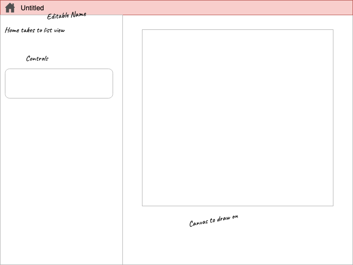
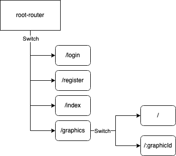
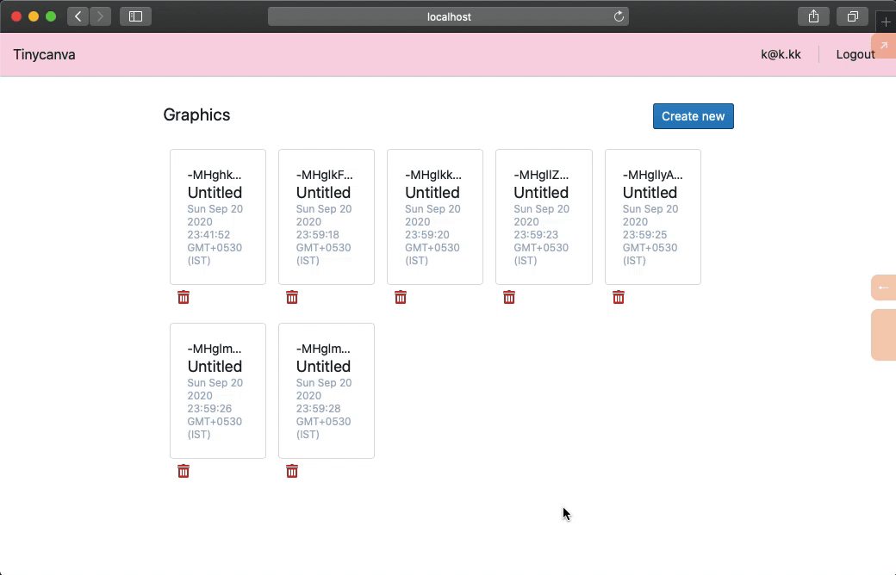

# Graphic details page
With the graphics list in place, we will now build the details page for each graphic. The details page will include an editor component that will let us draw the actual graphic. In this chapter, we'll focus on the routing aspect and not concern ourselves with the actual editor.



## Parsing route params
React router provides various mechanisms to parse route params (`:graphicId` in our case). There is a HOC based approach using `withRouter` HOC and a hooks based approach using the `useParams` hook. We are going to use `withRouter` HOC in our app. You can use hooks too, but Reagent's support for hooks is limited as of this writing.

The `withRouter` HOC expects a React component as an argument. One tiny issue with React components is that ratoms don't work with React. But ratoms work fine as children of React components. The solution is to create a transparent wrapper to the desired Reagent component and pass in the props manually. Then reactify this wrapper component, so ratoms continue to work. Let's understand this with an example:

```clojure

(def counter-atom (r/atom nil))

;; reagent component that needs route props and depends on ratoms
(defn x-page [props]
	(let [counter @counter-atom]
	;;...
	))

;; container component that will be reactified
(defn x-page-container [props]
	[x-page props])

;; somewhere in the router
[:> Route {:to "/g/:id"}
	[:> (withRouter (r/reactify-component x-page-container))]]
```

Now `x-page-container` is reactified and cannot use ratoms, however, all its children can safely use ratoms.


## Graphics page `Switch`
The details for a graphic will be available at `/graphics/:graphicId` route. As per our [app structure](/courses/courses/tinycanva-clojure-for-react-developers/tc-app-struct-auth-ui/), the namespace responsible for this route is `app.pages.graphics.detail`.

We will also need an additional `Switch` component in `app.pages.graphics` since we need to compose routes as follows:



Let's update our `app.pages.graphics` namespace to accommodate this `Switch`:

{lang=clojure,crop-start-line=46,crop-end-line=62}
<<[./tinycanva/src/app/pages/graphics.cljs](./protected/source_code/tinycanva/src/app/pages/graphics.cljs)

- We extracted the existing `page` component to `list-component`
- Replaced `page` with a `Switch`
- When the route `path` is `/graphics` the `list-component` will be rendered and
- When the route `path` is `/graphics/:graphicId`, the `graphics-detail-container` will be reactified and rendered. It will also receive route properties courtesy of `withRouter` HOC.
- `graphics-detail-container` internally renders the `detail/page` component, which we haven't created yet 
- The `exact` prop prevents the `list` component from being rendered on `/graphics/:graphicId`. It's how React Router composes.

## Link graphic card
The `graphic-card` component should redirect the user to `/graphics/:graphicId` when the card is clicked. We can achieve this by using React Router's `Link` component.

Let's update our card and wrap it's content in a `Link`:

{lang=clojure,crop-start-line=17,crop-end-line=28}
<<[./tinycanva/src/app/pages/graphics.cljs](./protected/source_code/tinycanva/src/app/pages/graphics.cljs)

The `id` passed to the graphic is a keyword. The `name` function converts a keyword into a string.

If the id of a graphic was string `-MXfh42`, then the `id` argument will be keyword `:-MXfh42` and the `:to` prop will be `/graphics/-MXfh42`. 

If the `name` function was not used, the `:to` prop would have been string: `/graphics/:-MXfh42`, which might have caused issues with parsing.

## Detail component
We can now populate the `app.pages.graphics.detail` component to realise our wireframe:

{lang=clojure,crop-start-line=1,crop-end-line=7}
<<[./tinycanva/src/app/pages/graphics/detail.cljs](./protected/source_code/tinycanva/src/app/pages/graphics/detail.cljs)

We `:require`d the packages and namespaces we need for this component. Let's create the `page` next:

{lang=clojure,crop-start-line=21,crop-end-line=34}
<<[./tinycanva/src/app/pages/graphics/detail.cljs](./protected/source_code/tinycanva/src/app/pages/graphics/detail.cljs)

That's too many lines of code to cover! Let's break everything down:
1. The props will be a map with keys `:location`, `:match` and `:history`. A `:params` map will be present in the `:match` object. The key-values of the `:params` map will be a JS object of parsed route parameters. Since we are on the `/graphics/:graphicId` route, the parsed params JS object will contain `graphicsId`. `goog.object/getValueByKeys` is a GCP function and is equivalent to `get-in` for JS objects. If you have a nested JS object like `{"a": {"b" : "c"}}`, then `(getValueByKeys obj "a" "b")` will return "c".

2. When we have the `:graphicId` we subscribe to `app-db` to get the graphic with that id, we will write this subscription soon.

3. When the `graphic` is available ie. the route is parsed and subscription is realized, we can render the actual component. 

4. The `nav` component is not global navigation, but local navigation as shown in the wireframe. 

We also render the string version of the `graphic` object so we can see things in action.


## Graphic by id subscription
This subscription is similar to `:a.d.f/deleting-graphic-id?` subscription. It accepts a `graphic-id` and returns the value for that id:

{lang=clojure,crop-start-line=211,crop-end-line=214}
<<[./tinycanva/src/app/domain/firebase.cljs](./protected/source_code/tinycanva/src/app/domain/firebase.cljs)


## Local navigation bar
This navigation bar has two purposes:
- to link back to the home page (ie. `/graphics`) and
- Show the name of the graphic

We will use Blueprint's `Navbar` component again to get this up. Since this component is used only by graphic details page, we can place it inside `app.pages.graphics.detail`:

{lang=clojure,crop-start-line=11,crop-end-line=19}
<<[./tinycanva/src/app/pages/graphics/detail.cljs](./protected/source_code/tinycanva/src/app/pages/graphics/detail.cljs)

We haven't used the `graphic-id` argument but will need it to update the name in later sections.

The navbar is blue this time, but feel free to choose your own colors. With everything in place, you should be redirected to the details page when you click on a card:



## Conclusion
In this chapter, we used the `withRouter` HOC to capture route params. We also built the graphics detail page and updated graphic cards to redirect to these details.

## Recommended reading
- [Using hooks with Reagent](https://github.com/reagent-project/reagent/blob/master/doc/ReactFeatures.md#hooks)
- [Reagent compiler options to generate true React functional components instead of Reagent's class based components](https://github.com/reagent-project/reagent/blob/master/doc/ReagentCompiler.md)

