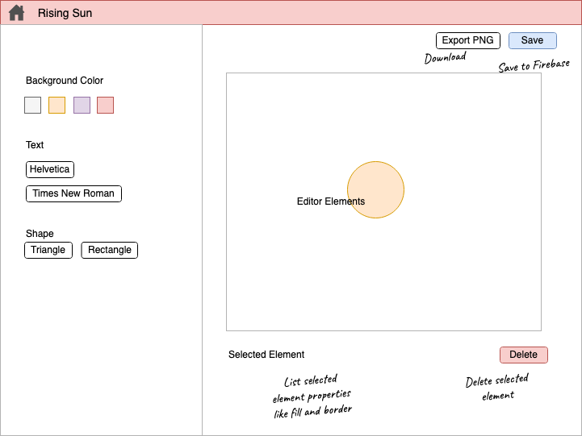
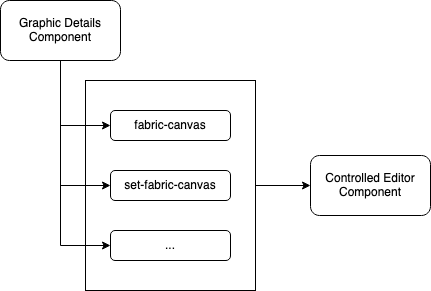
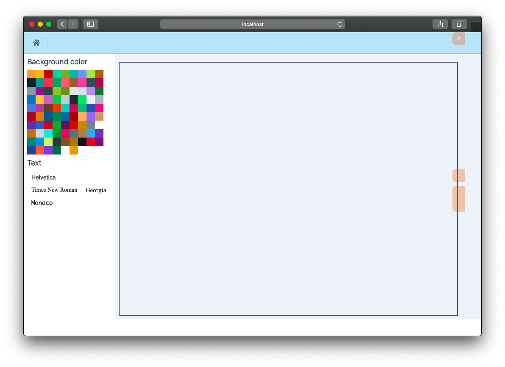
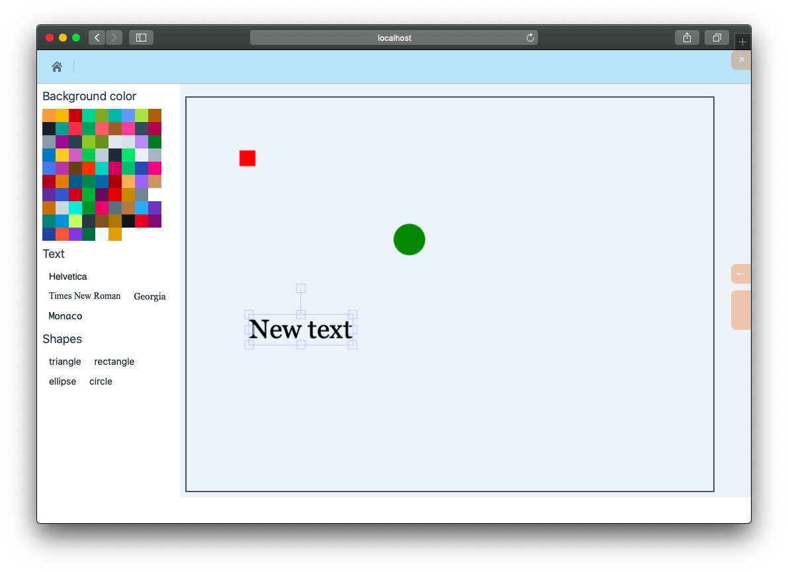

# Graphics Editor

Editing graphics on the web requires working with the `canvas` element. [Fabric](http://fabricjs.com/) is a popular canvas library that we are going to use. We'll create an editor component to show at the `/graphics/:graphicId` route.

By the end of this chapter, we'll have an editor with a canvas and options to add elements like shapes, text, etc:



The big idea is to develop the `editor` component like a controlled component, for example, an input. This way, we can pass the initial value of the canvas to the editor and add an on-change handler, and keep the editor mostly pure:




## Install dependencies

We'll need the `fabric` and `file-saver` package to build our editor:

```bash
yarn add fabric file-saver
```

`fabric` provides a pragmatic wrapper to HTML5 Canvas and `file-saver` helps in downloading files, which will be helpful for exporting our graphics.

## Editor component

Fabric works by hijacking an existing canvas node and elevating it to a [`fabric.Canvas`](http://fabricjs.com/docs/fabric.Canvas.html) object. This enables Fabric's rich API. It lets us add and remove objects like text, SVG, and images. It also lets us serialize and de-serialize the canvas.

We will create an editor component in `app.components.editor`.

### Setup editor namespace

Here's the `ns` setup. We have imported all the required dependencies for the sake of convenience, but feel free to add deps as and when you need them:

{lang=clojure,crop-start-line=1,crop-end-line=5}
<<[./tinycanva/src/app/components/editor.cljs](./protected/source_code/tinycanva/src/app/components/editor.cljs)

### Accessing fabric classes

`fabric` exposes a variety of classes that we'll need to initialize objects. The ES6 syntax for importing with `fabric` is:

```javascript
import {fabric} from "fabric";
const c = new fabric.Canvas(args)
```

The equivalent CLJS would be:

```clojure
(ns ...
	[:require "fabric" :refer (fabric)])

(def c (new (aget fabric "Canvas") args))
```

We also need to ensure that all `args` passed to `fabric` are native JS objects and not CLJS data structures, ie. be prepared to call `clj->js` excessively. Data shape is a common source of bugs while dealing with native JS libraries.

### Canvas component

To be able to work with `fabric`, we need a `canvas` element in the DOM. Once the canvas element exists, we need to initialize the `fabric.Canvas` class. We also need to clean up when the canvas is unmounted.

Let's create a canvas component using `r/create-class`:

{lang=clojure,crop-start-line=7,crop-end-line=30}
<<[./tinycanva/src/app/components/editor.cljs](./protected/source_code/tinycanva/src/app/components/editor.cljs)

- The `canvas` component is a class-based component that receives the `f-canvas`, ie. `fabric.Canvas` object, a `set-f-canvas` and `set-selected-object` function. We'll talk about `set-selected-object` later in this chapter. `f-canvas` and `set-f-canvas` are equivalent to `value` and `on-cahnge` props on an input component. This makes canvas controlled, ie. when `f-canvas` changes, the parent will be notified. It will make more sense soon.

- The `:display-name` property helps with debugging

- The `:reagent-render` method renders a `:canvas` element with id `c`

- In `:component-did-mount` method, a `fabric.Canvas` object is initialized on the canvas with id `c`. This method is called after the first render, ie. the `canvas#c` will be available in DOM. The initialized canvas is given some default properties like the `:height` and the `:width`. Then the `set-f-canvas` method is called, indicating to the parent that the controlled component changed state.

- The call to `.on` method is a hook into Fabric's event system, we'll cover this soon

- The `:component-will-unmount` method cleans up the initialized canvas by calling the `.dispose` method on `f-canvas`

### Background color component
The `canvas` will on enhance the native HTML5 canvas, but we need more tools to manipulate it. The `bg-color` tool will present the user with a list of colors to set as the canvas background:

{lang=clojure,crop-start-line=32,crop-end-line=49}
<<[./tinycanva/src/app/components/editor.cljs](./protected/source_code/tinycanva/src/app/components/editor.cljs)

The `bg-color` components compute the list of [`Colors`](https://blueprintjs.com/docs/#core/colors) provided by Blueprint. We then render each color using the `bg-color-card` component. The `tool-title` component will help us to render titles for other tools.

`bg-color` accepts `f-canvas` object and when a color is clicked, we call Fabric's `setBackgroundColor` function. Setting background color changes the value of the color, but the changes are not flushed to DOM until the `requestRenderAll` method is called on `f-canvas`. `setBackgroundColor` also accepts a callback function, which is called after the editor state is modified. We passed an anonymous callback function to re-render the canvas.

### Editor component foundation
The `canvas`, `bg-color`, and some other tools will together constitute the editor component. We'll build some other tools as we proceed, but for now, we'll set up the foundation of our editor component and render it at the `/graphic/:graphicId` route.

Let's create and `editor` component in `app.components.editor` namespace:

```clojure
(defn editor [{:keys [f-canvas set-f-canvas]}]
  [:div.flex.bg-gray-200
	;; sidebar
	[:div {:class "w-1/3 md:w-1/5 px-2 bg-white"}
      (when f-canvas
        [:<>
         [bg-color f-canvas]
         ])]
	 ;; canvas area
     [:div {:class "w-2/3 md:w-4/5 p-2"}
      [:div.mt-3
       [canvas f-canvas set-f-canvas #()]
       ]])
```

The `editor` is a container for our Fabric canvas and other tools. We used Tailwind CSS to create a sidebar for the tools, like in the wireframe, and a content area for the canvas. Notice how we passed an empty function as the third argument to `canvas`. We'll update this later when we hook into Fabric's event system.


We can now render this in `app.pages.graphics.detail`:

```clojure
;; 1
(def editor-state (r/atom {}))

(defn page []
  (let [graphic-id (-> props
                       :match
                       (goog.object/getValueByKeys "params" "graphicId")
                       keyword)
        graphic (when graphic-id
	               @(rf/subscribe [:app.domain.firebase/graphic-by-id graphic-id]))
		]
    [:<>
     [:> router/props-elevator {:elevate-fn #(reset! route-props %)}]
     (when graphic
       [:<>
        [nav graphic-id graphic]
		;; 2
        [editor/editor {:f-canvas (-> editor-state deref :f-canvas)
                        :set-f-canvas #(swap! editor-state assoc :f-canvas %)}
						]])]))
```

There are two changes that you need to make to the existing `app.pages.graphics.detail/page` component:
1. `def`ine a ratom to hold the editor's state
2. Render the `editor` component with `f-canvas` and `set-f-canvas` props. Notice how this is similar to an `input` component (`f-canvas` is equivalent to `value` and `set-f-canvas` is equivalent to `on-change`)

`(when graphic` check is needed because `f-canvas` can be `nil` on the first render.


### Text tool
The `text` component will let us add text to the `canvas` in a variety of font styles:

{lang=clojure,crop-start-line=51,crop-end-line=64}
<<[./tinycanva/src/app/components/editor.cljs](./protected/source_code/tinycanva/src/app/components/editor.cljs)

- `text` component uses a predefined list of font families and renders a `Button` for each font family. The fonts we used are generally installed on most systems, but you can use custom fonts too, just make sure you have loaded them
- The `on-click` method of the `Button` calls the `add-text` function which is responsible for creating a `fabric.IText` object and adding it to  `f-canvas`
- The `IText` object constructor requires the initial text to display, `New text` in our case and a set of properties. We have set the `:fontFamily` property in the constructor, but many other [`IText` properties](http://fabricjs.com/docs/fabric.IText.html) can be set.
- `:font-family` will not work! Conversion from `kebab-case` to `cameCase` is done implicitly for Reagent components, by Reagent, but this is a Fabric js object that we are initializing
- `Itext` is derived from `fabric.Object`. Shapes, text, images, SVG, etc are all derived from `fabric.Object` and share common properties. 
- `fabric.Canvas`'s `.add` method helps us add any object to the canvas

We can render the `text` component inside the editor:

```clojure
[:<>
  [bg-color f-canvas]
  [text f-canvas]]
```



### Shape tool
The `shape` tool will let us add geometric shapes to the canvas. We have setup sensible defaults to render the shape initially:

{lang=clojure,crop-start-line=66,crop-end-line=84}
<<[./tinycanva/src/app/components/editor.cljs](./protected/source_code/tinycanva/src/app/components/editor.cljs)

- The `shapes` component defines a list of shapes we are going to cater to. This list is not exhaustive. Fabric provides support for other shapes like line and point, which can be added to the same structure
- The `make-shape` function helps us generate the shape object. All shapes are derived from the `fabric.Object` class.
- The `add-shape` function generates a shape object depending on the arguments. It also sets sane default properties for shapes (like fill color and dimensions). Again this list of properties is not exhaustive. Fabric lets us initialize shapes with as much configuration as we need.



We can render the `shapes` component inside the editor:

```clojure
[:<>
  [bg-color f-canvas]
  [text f-canvas]
  [shapes f-canvas]]
```

## Conclusion
In this chapter, we set up the `editor` component wrapping Fabric's functionality. We added tools to change the background color of the canvas, add text, and SVG shapes. Our editor is pretty basic but serves as a solid foundation for building something more complex.

You can also create a tool to add images from a URL using [`fabric.Image`](http://fabricjs.com/docs/fabric.Image.html) class. The process will be similar to text or shape since the image is derived from `fabric.Object`.

In the next chapter, we'll create the functionality to save our graphics in Firebase and edit object properties.

