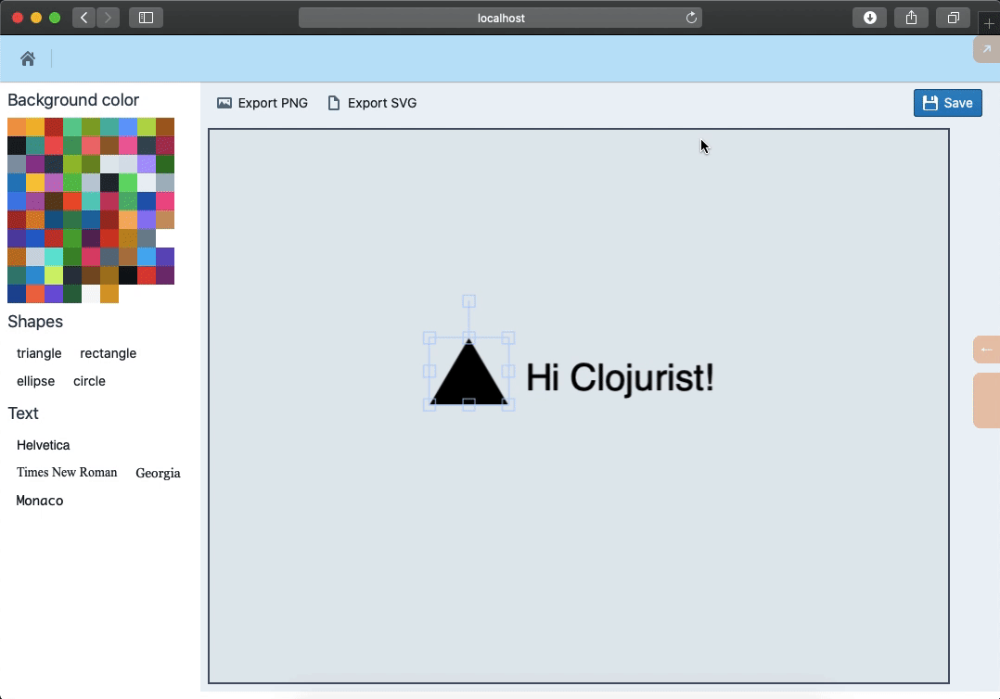

# Saving graphics
We have an editor in place, but it doesn't save data to Firebase. It is also not equipped to load data from Firebase. In this chapter, we'll create Reframe components to store data. We'll then update the editor to load data from Firebase.

## Update Firebase Reframe components
Saving a graphic is technically an update event since the graphic already exists in Firebase. Update Firebase objects include making a call to the `update` method with a node and keys to edit. Our graphic currently has two keys: `name` and `created-at`.

`update` function overwrites or creates new key-value pairs, ie. if we pass `name` to the update function, the existing `name` will be overwritten. But if we pass a non-existent field like `fabric-json`, a new key-value pair will be created.

### Event handler
We have so far dispatched an event before writing a handler. But we'll create the handler first in this case, because we don't have a UI yet:

{lang=clojure,crop-start-line=115,crop-end-line=135}
<<[./tinycanva/src/app/domain/firebase.cljs](./protected/source_code/tinycanva/src/app/domain/firebase.cljs)

`update` handler is similar to the `delete` handler. We set the loading indicator and request to call the `:firebase/delete` effect. The `:on-success` and `:on-error` events are dispatched in response to the SDK call. Notice how we pass the `graphic-id` and `new-graphic` map as the `:on-success` handler. This is required to update the `app-db` when the Firebase update call is successful.

In the `on-success` handler, we take the freshly saved graphic and update the value of `fabric-json` in `app-db`. This is passed to the `editor` component as `init-state`.

### Effect handler
The `:firebase/update` effect handler calls `update` on the given `node` and dispatches `on-sucess` and `on-error` events respectively:

{lang=clojure,crop-start-line=194,crop-end-line=202}
<<[./tinycanva/src/app/domain/firebase.cljs](./protected/source_code/tinycanva/src/app/domain/firebase.cljs)

### Loading subscription
We need the `::updating-graphic?` flag to show a loading indicator:

{lang=clojure,crop-start-line=248,crop-end-line=250}
<<[./tinycanva/src/app/domain/firebase.cljs](./protected/source_code/tinycanva/src/app/domain/firebase.cljs)

## Connect editor to Reframe state
The `editor` component has two dependencies on the Reframe state:
1. It needs to save the current graphic to Firebase
2. It needs to render the already saved graphic to Canvas

To tackle this, we need to update the `app.pages.graphics.detail/page` component and make this data available to the editor:

{lang=clojure,crop-start-line=27,crop-end-line=47}
<<[./tinycanva/src/app/pages/graphics/detail.cljs](./protected/source_code/tinycanva/src/app/pages/graphics/detail.cljs)

We made two changes to the `page` component. We added a subscription to `updating-graphic?` and passed in 3 extra props:
- Update flag
- Function to save the graphic (dispatches the `:a.d.f/update-graphic` event) and
- Initial state of the graphic canvas. Notice the `:fabric-json` key. We don't have it yet, but we'll store the JSON representation of the canvas under this key

We have passed all the required props to the editor. Let's now modify it with the ability to save data.

## Saving Fabric canvas to Firebase

`fabric.Canvas` ships with a `toJSON` method. This method converts the canvas into a JS object which can be saved in a database and used to re-create the canvas later. We'll create a `toolbar` component to house the save button. We'll also add the functionality to save the canvas as svg or png:

{lang=clojure,crop-start-line=86,crop-end-line=111}
<<[./tinycanva/src/app/components/editor.cljs](./protected/source_code/tinycanva/src/app/components/editor.cljs)

`toolbar` consists of three buttons:
- `Save` button calls the `on-save` handler with the JSON state of `f-canvas`. This dispatches the `::update-graphic` event
- `export-png` function converts the `fabric.Canvas` into PNG using `toDataURL` function, then `saveAs` function from `file-saver` is used to download this graphic
- `export-svg` function is similar to `export-png`, except it converts the canvas into an SVG. You can check alternate uses of `saveAs` at the [official repo](https://github.com/eligrey/FileSaver.js/).

Finally, we need to connect this `toolbar` to the `editor` (you also need to change the definition to accept extra props):

```clojure
;; update the canvas to accept `on-save`, `saving?` and `init-state` props:
;; (defn editor [{:keys [f-canvas set-f-canvas saving? on-save init-state]}] ...)

[:div {:class "w-2/3 md:w-4/5 p-2"}
      (when f-canvas
        [toolbar f-canvas saving? on-save])
      [:div.mt-3
       [canvas f-canvas set-f-canvas #()]]]
```

With the `toolbar` in place, you would be able to download and save the graphic to Firebase:



## Loading existing graphics

We have saved the JSON state of the canvas already, but if you open a canva->save->go back to the graphics page and open it again, you will not see the saved state. This is because we haven't equipped the `editor` component to load the existing state. The `:fabric-json` is passed to the editor as the `init-state` argument. We can update the `editor` component to initialize `f-canvas` using the `initial-state`, ie. the saved state:

```clojure
(defn editor [{:keys [f-canvas set-f-canvas saving? on-save init-state]}]
  ;; check if f-canvas is initialized and init-state is not nill,
  ;; if so, load the init-state using loadFromJSON method
  (when (and f-canvas init-state (not saving?))
    (.loadFromJSON f-canvas (clj->js init-state)))

  [:div.flex.bg-gray-200
   [:div {:class "w-1/3 md:w-1/5 px-2 bg-white"}
    (when f-canvas
      [:<>
       [bg-color f-canvas]
       [shapes f-canvas]
       [text f-canvas]
       ])]
   [:div {:class "w-2/3 md:w-4/5 p-2"}
    (when f-canvas
      [toolbar f-canvas saving? on-save])
    [:div.mt-3
     [canvas f-canvas set-f-canvas #()]
     ]]])
```
Notice the use of `loadFromJSON` on `f-canvas`. When the graphic has saved `fabric-json`, it will be available as the `init-state` prop. When the component renders, the `init-state` will be applied to the `f-canvas`.

## Editing existing Fabric objects
Our `editor` is more mature now, it can save and load graphics to and from Firebase. But it's still limited in terms of object editing. An object once added cannot be removed or modified.

To allow for editing capabilities, we need to hook into Fabric's `mouse:down` event. If you recall setting up the `canvas` component, we added a handler for `mouse:down` but didn't talk about it:

{lang=clojure,crop-start-line=18,crop-end-line=19}
<<[./tinycanva/src/app/components/editor.cljs](./protected/source_code/tinycanva/src/app/components/editor.cljs)

When a user clicks on a Fabric object in the canvas, Fabric calls the registered `mouse:down` handler. The handler receives the clicked object as an argument. If we save this clicked object in the local state, we can modify its properties and delete it if need be.

### Setup local state to hold selected-object
The `canvas` component expects a function `set-selected-object` as its third argument. We have been passing an empty function to it so far, but can now create some local state and pass a real function:

{lang=clojure,crop-start-line=113,crop-end-line=113}
<<[./tinycanva/src/app/components/editor.cljs](./protected/source_code/tinycanva/src/app/components/editor.cljs)

The `editor` component will end up looking as follows:

{lang=clojure,crop-start-line=144,crop-end-line=164}
<<[./tinycanva/src/app/components/editor.cljs](./protected/source_code/tinycanva/src/app/components/editor.cljs)

- We passed in a function to `reset!` the `selected-object` to `canvas` component
- We also rendered a non-existent `properties` component to edit the properties of the `selected-object`

### Properties editor component

A `fabric.Object` has various properties that control its dimensions, placement, and style. The job of the `properties` component is to allow us to modify each of these properties.

An object's properties are an object of key-value pairs. The key is the property name, like `fontFamily` for the `IText` object and the value is its corresponding value `Helvetica`. The values can be strings, numbers, or booleans. A value can be changed by calling the `set` method on that object.

For the sake of convenience, we'll treat all property values to be strings. We'll then render a text box for each of the property to allow the user to edit it:

{lang=clojure,crop-start-line=139,crop-end-line=142}
<<[./tinycanva/src/app/components/editor.cljs](./protected/source_code/tinycanva/src/app/components/editor.cljs)

The `properties` component reactively listens to the `selected-object` local state and renders the `f-obj->props-form` component for the selected Fabric object.

### Fabric object to props form

The form component will render the object's type, a delete button and list of inputs to edit each property:

{lang=clojure,crop-start-line=115,crop-end-line=137}
<<[./tinycanva/src/app/components/editor.cljs](./protected/source_code/tinycanva/src/app/components/editor.cljs)

- Object type helps us identify the object that was selected (`IText`, `Rect`, `Circle` etc)
- Delete button deletes the selected object and clears it from the local state. This is done using the `remove` method on the selected Fabric object
- All properties of a `fabric.Object` can be determined by converting `f-obj` to a regular object (ie. serializing object). We also converted the properties into a CLJS map in the `let` binding
- We next `render` all `kv-pairs` as an uncontrolled component. The `defaultValue` prop of Blueprint's `InputGroup` helps set the initial value of the input
- The `on-change` handler updates the object's properties using the `.set` method, it also re-renders the canvas, which is needed for the change to reflect in the UI

If everything worked, you will see a property editor panel at the bottom of the canvas when you select and object:


If you change a property like `fill`, the canvas will update too. You will notice that many properties are boolean or integers. With this approach, you can only edit string-based properties. There are also properties like `version` that you should not edit at all.

In a real-world application, we can build special components for each property type and only edit a subset of the components. We are not going to build it, but by now you should know enough Clojure and Reagent to build it yourself!

## Conclusion

In this chapter, we built Reframe components to save the graphic to Firebase. We also enhanced our editor and made it capable of loading data from Firebase. This marks the end of the Tinycanva module.

Over the last few chapters, we took a deep dive into ClojureScript's UI eco-system and applied our knowledge to practice. We built a full application with CRUD models, authentication, and a web-based graphic editor. In this process, we learned about Shadow, Reframe, Reagent, and ClojureScript in general. Hope you picked up ideas and development styles.

What we have built, although not ideal, sets up a solid foundation to take on ClojureScript projects. In the next module, we'll study some advanced features and make our application production-ready.

