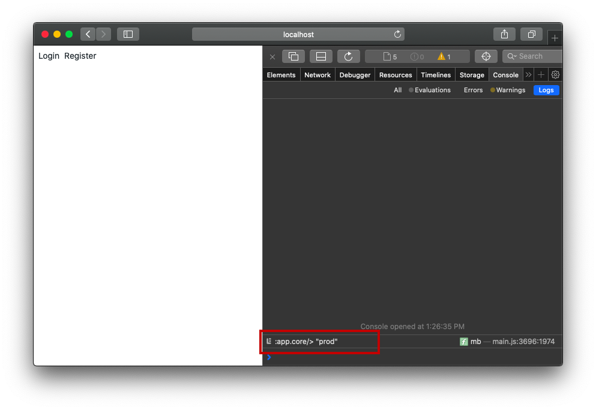

# Production packaging
Pushing a frontend app to production consists of three significant steps:
- setting up the production config
- code splitting
- minification of code and assets.

In this chapter, we'll apply the production config to our Tinycanva app and produce a deployable bundle. We'll focus on code splitting in the next chapter.

## Add production config
Tinycanva config lives in the `app.config` namespace. It has two environments: `dev` and `prod`, and a function to select config for a certain environment. The current configuration includes only Firebase, but a real-world app might have multiple API endpoints, analytics id, and other data.

For the sake of simplicity, we'll assume that our `prod` config is the same as for `dev`. Let's copy the `dev` config map to `prod`:

{lang=clojure,crop-start-line=14,crop-end-line=23}
<<[./tinycanvas/src/app/config.cljs](./protected/source_code/tinycanva/src/app/config.cljs)

## Loading prod config via environment variable
The config is loaded in the `app.core` namespace. When we first set up the config, we hardcoded `:dev` as the default environment.

To switch this environment pragmatically, we'll use [bash environment variables](https://opensource.com/article/19/8/what-are-environment-variables).

First up, we need to read the environment variable and make it available to the application. This can be done using a combination of [`#shadow/env`](https://shadow-cljs.github.io/docs/UsersGuide.html#shadow-env) and [`:closure-defines`](https://cljs.github.io/api/compiler-options/closure-defines).

`#shadow/env` helps us read an environment variable, whereas `:closure-defines` sets a value to a variable in any namespace. Note the spelling `closure`. This is not a typo and we didn't mean `clojure`.

[comment]: <GM: define it AS app.core?>
`:closure-defines` is a property of Google's Closure Compiler, which is used by ClojureScript to compile CLJS to JS. Let's update our `shadow-cljs.edn` to read this environment variable and define it `app.core`:

{lang=clojure,crop-start-line=2,crop-end-line=8}
<<[./tinycanvas/shadow-cljs.edn](./protected/source_code/tinycanva/shadow-cljs.edn)

The `:closure-defines` line essentially asks Shadow to define env. variable `app.core/app-env` with the value of env. variable `APP_ENV`.

This variable can now be read in `app.core` using `goog-define`:

{lang=clojure,crop-start-line=15,crop-end-line=19}
<<[./tinycanvas/src/app/core.cljs](./protected/source_code/tinycanva/src/app/core.cljs)

`goog-define` is similar to `def`. The only difference is that unlike `def` which is evaluated at runtime, `goog-define` is evaluated at compile time.

We used `goog-define` to set the default value of `app-env` as "dev". This will be overwritten by the value in `:closure-defines`. We then used this value to load the applicable config.

## Production build
The last step is to set the environment variable to "prod" for production build. Production builds are created using `shadow-cljs release` command. This command uglifies and minifies the codebase. `create-cljs-app` sets a NPM script `build` to run this command. We can update `package.json` and set the environment variable to `prod` for this command:

{lang=clojure,crop-start-line=11,crop-end-line=11}
<<[./tinycanvas/package.json](./protected/source_code/tinycanva/package.json)

Now if you close the `watch` process and execute `yarn build` in your terminal, the app will be compiled to the `public` folder in production mode:

```bash
$ yarn build
yarn run v1.21.1
$ yarn clean && APP_ENV=prod shadow-cljs release app
$ rimraf public/js

;; logs and warning

[:app] Build completed. (325 files, 263 compiled, 0 warnings, 101.92s)
✨  Done in 136.18s.
```

At this point, our shadow app is a static frontend app that can be served using any server. Let's try to run it:

```bash
$ cd public
$ npx serve
# or python3 -m http.server
```

You'll notice that the app runs with the "prod" configuration.



The `/public` folder can now be deployed to any provider (Netlify, Vercel, Surge, S3) to make your app accessible to the internet.

## Conclusion
In this chapter, we learned how to use environment variables to apply environment-specific config. We also learned how to package CLJS apps for deployment.
