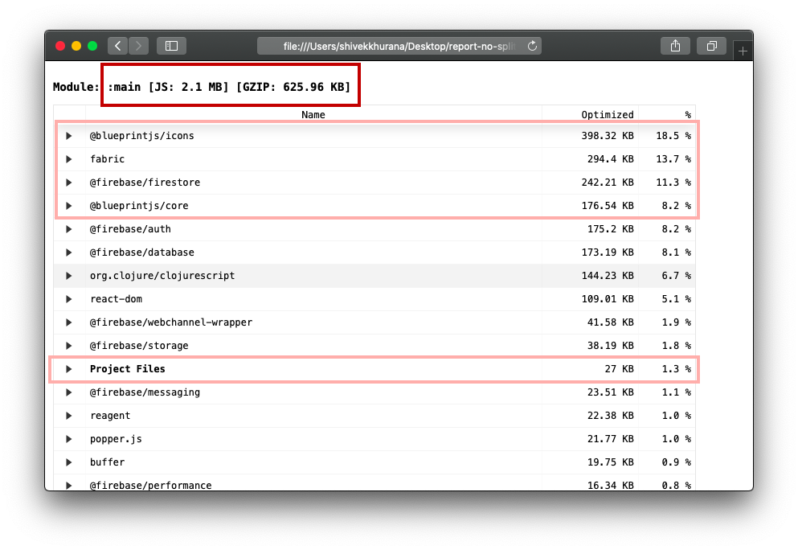
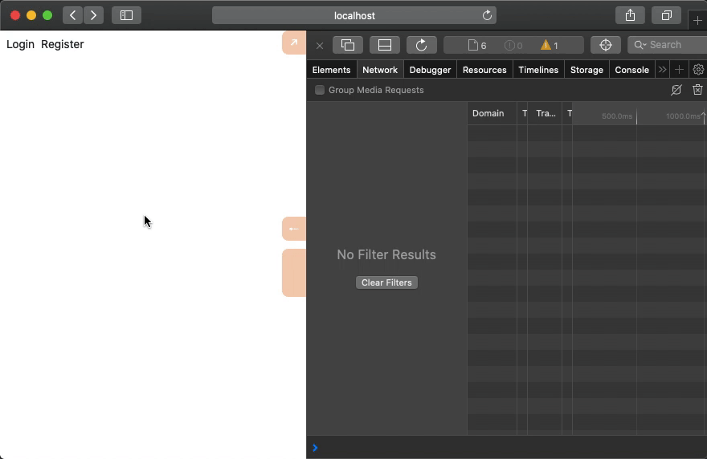

# Code splitting
The JS ecosystem makes developing JS apps fast, but installing libraries affects the bundle size.

It's normal for a JS app to be 1-5 megabytes before gzip. This means that a client has to parse at least 1MB of JS code for it to make any sense. This might not be a problem for shiny Macbooks but is definitely a concern for low-end mobile hardware.

Shadow provides us an efficient API to analyze and split our code into smaller chunks.

## Bundle size reports
Before we get into the details of code splitting, we need a way to measure where we stand. Shadow comes with a built-in reporting tool that lists the size and ingredients of bundled modules. We can generate a report using the `yarn report` command.

After running this command, the output will be printed to your terminal and also in a file called `report.html`:



Our app is currently 625kb gzipped without any code splitting. The report also tells us about the elephants in the room. The four heaviest modules contain 50% of the code. Our project files (ie the code we wrote) are only 1.3% of the compiled code.

We'll try and optimize this and regenerate reports as we go to check our progress.

## Code splitting
The process of code splitting comprises two steps:
1. configuring the compiler
2. modifying the app to load split code

With just one large bundle, we don't need to worry if our code is loaded yet, but with multiple smaller bundles, we need to ensure that all required code is available. One way to split code is to bundle code by routes, ie to have one module per route.

We have three main routes that we can split for: `/login`, `/register`, and `/graphics`. In the real world, you might also want to split out heavy components. For example, in our case, we can't really do anything about Blueprint, because that's our UI layer, but Firebase and Fabric are not needed to render the `/` index route.

### Shadow configuration
Shadow splits code by clubbing entry points into `modules`. Module is a generic term, but you can think of splitting out modules as files.

Currently, our Shadow configuration only generates one module `:main`: - just one file `main.js` that we load in `index.html`. Let's update our configuration to generate one module per route:

{lang=clojure,crop-start-line=3,crop-end-line=11}
<<[./tinycanva/shadow-cljs.edn](./protected/source_code/tinycanva/shadow-cljs.edn)

- `:module-loader true` injects additional code that enables fetching of modules at runtime
- We added three additional modules `:login`, `:register` and `:graphics`. This will lead to the creation of `login.js`, `register.js` and `graphics.js` along with `main.js` in the configured `:output-dir`.
- Only one module needs to be dependency-free: the root module, essential for the app to work
- Other modules can mark dependencies using the `:depends-on` configuration, which accepts a set. It's possible to depend on more than one module. All modules need to depend on the root module.
- The `:entries` key accepts a vector of namespaces that need to be clubbed inside the module.

Shadow computes the dependency graph and tries its best to put most code outside the root module. Think of it as trying to generate a small `:main` file and pushing heavy components to other modules. However, this not always accurate and requires tuning.

### Lazy HOC
We have the modules now, but if you run the app as it is, Shadow will complain about not being able to split modules. This is because the modules we split out are not being loaded dynamically.

Since we split modules by routes and our routes are Reagent components, we need to create a component capable of lazy loading modules.

For other code, which is not in React lifecycle, `shadow.loader/load` function can be used to load modules when required:

```clojure
;; load returns a goog.async.Deferred, and can be used like a promise
(-> (loader/load "extra")
    (.then fn-to-call-on-load fn-to-call-on-error))
```

*Example copied from [Shadow Docs](https://shadow-cljs.github.io/docs/UsersGuide.html#_loading_code_dynamically)*

Let's create a `lazy-comp`onent to load our Reagent components dynamically:

{lang=clojure}
<<[./tinycanva/src/app/components/lazy.cljs](./protected/source_code/tinycanva/src/app/components/lazy.cljs)

We use the `shadow.lazy` namespace and call `load` method on `loadable` argument in `component-did-mount`. `loadable` is the component we want to load. The `load` function accepts a loadable argument and a callback. Our callback updates the `loaded` state to `true`.

In the render method, we then check if the `loaded` state is `true`, and render accordingly. `loadable` is an atom-like object that can be dereferenced to get the dynamically-loaded module. 

The dynamically-loaded module in our case will be a Reagent component, so we render it as `[@loadable]`. This will make sense in just a moment!

### Removing `:require` statements
Shadow is not able to split modules because `app.core` `:require`s all pages, essentially leading to a graph that cannot be split. We can safely remove the vectors that require `login`, `register` and `graphics` page:

{lang=clojure,crop-start-line=8,crop-end-line=11}
<<[./tinycanva/src/app/core.cljs](./protected/source_code/tinycanva/src/app/core.cljs)

Now we need to load these modules using `lazy-comp`. For this, we need to `:require` the `lazy-comp` and `shadow.lazy` package:

{lang=clojure,crop-start-line=12,crop-end-line=13}
<<[./tinycanva/src/app/core.cljs](./protected/source_code/tinycanva/src/app/core.cljs)

Finally, we can update the `root-router` to render components lazily:

{lang=clojure,crop-start-line=24,crop-end-line=42}
<<[./tinycanva/src/app/core.cljs](./protected/source_code/tinycanva/src/app/core.cljs)

We replaced the actual components with `lazy-comp` and passed the required component to `sl/loadable`. `shadow.lazy/loadable` is a macro that takes a namespace-qualified definition, figures out the module it is present in and provides an API to load this module.

`sl/loadable` is a macro and not a function, and it cannot be moved inside `lazy-comp`. This is passed as the `loadable` argument to `lazy-comp`, which when dereferenced using `@` returns the component.


Now, if you load the app (in logged out state) and navigate from `/` index to `/login`, you'll see a network call to load `login.js` (and probably the message `Lazy loading ...`):



Using `lazy-comp` directly (`[lazy-comp (sl/loadable app.pages.graphics/page)]`) didn't work for the `/graphics` route as the react-router's `Redirect` has some issues with `Switch`, and it prevents the component from rendering:
- https://stackoverflow.com/questions/42875949/react-router-v4-redirect-not-working?rq=1
- https://github.com/ReactTraining/react-router/issues/6840

By adding an extra wrapper `graphics-container`, the component loads fine.

## Checking progress
If you check the report again, you'll notice we have reduced the `main` bundle size to 1.83 MB (2.1 MB earlier). This was mainly because Fabric was split and moved to `graphics` module:

- Module: :main [JS: 1.83 MB] [GZIP: 546.65 KB]
- Module: :login [JS: 2.18 KB] [GZIP: 839]
- Module: :register [JS: 1.38 KB] [GZIP: 596]
- Module: :graphics [JS: 336.62 KB] [GZIP: 96.58 KB]

Depending on your app, you might be able to create more modules and save more bytes, leading to a snappier experience.


## Conclusion
In this chapter, we learned about Shadow's lazy loading mechanism. We then configured Shadow to split the app into smaller modules and updated code with the ability to load modules at runtime.
