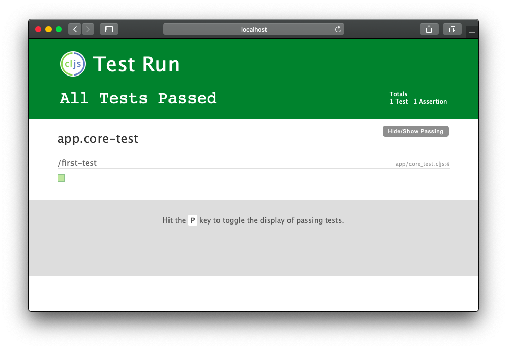

# Unit testing

Clojure core ships with a unit testing library called [`cljs.test`](https://clojurescript.org/tools/testing). The tests are generally put next to the file being tested. Tests for namespace `foo.bar` can be defined in `foo.bar-test`.

The default Shadow config that ships with `create-shadow-app` sets up tests with [devcards](https://github.com/bhauman/devcards). We are not going to use devcards, instead we will rely on `cljs.test`. Let's change the `:test` config:

{lang=clojure,crop-start-line=22,crop-end-line=25}
<<[./tinycanva/shadow-cljs.edn](./protected/source_code/tinycanva/shadow-cljs.edn)

[comment]: <GM: "lets us run a server for tests UI"? do you mean a server for UI tests? >
- `:target` specifies the runtime where the tests should run (could also be `:node-test`)
- `:test-dir` is the location of compiled test files
- `:devtools` lets us run a server for tests UI

Shadow considers all namespaces that `:require`d `cljs.test` as tests.

## Sample test namespace
Let's set up `app.core-test` namespace to learn about how the tests are set up:

{lang=clojure}
<<[./tinycanva/src/app/core_test.cljs](./protected/source_code/tinycanva/src/app/core_test.cljs)

- `testing` macro helps us define a scenario
- `deftest` macro helps us define the test
- `is` macro lets us assert predicates (for a test to pass, the predicate should resolve to `true`)

In our `first-test`, we asserted if 1 is equal to 1 -  complex stuff!

## Running tests
You can start the test in `watch` mode using `yarn test:watch` or run it once with `yarn test`. The `watch` mode will start a test UI server along with the app server:



With the server running in watch mode, the relevant tests will be re-run as you change the source code. You can also connect to the `:test` environment over nREPL.

## Testing Reframe event handlers
Reframe event handlers (and event subscriptions) are easy to test, since they are pure functions. But we need to modify our code a bit. Consider this event handler `::create-graphic-error`. You should have it in `:a.d.firebase` namespace:

```clojure
(rf/reg-event-db
 ::create-graphic-error
 (fn [db [_ error]]
   (-> db
       (dissoc ::creating-graphic?)
       (assoc ::create-graphic-error error))))
```
[comment]: <GM "if the handler adds the error"?>
In a unit test, we need to check:
1. if this handler removes the key `::creating-graphic?`
2. adds the error `::create-graphic-error`

But our handler is an anonymous function. We can fix this by defining the handler:

{lang=clojure,crop-start-line=80,crop-end-line=85}
<<[./tinycanva/src/app/domain/firebase.cljs](./protected/source_code/tinycanva/src/app/domain/firebase.cljs)

Now this handler can be tested for two use cases:

{lang=clojure,crop-start-line=1,crop-end-line=16}
<<[./tinycanva/src/app/domain/firebase_test.cljs](./protected/source_code/tinycanva/src/app/domain/firebase_test.cljs)

We created a contrived `db` map and passed it down to the event handler manually. This lets us test Reframe handlers without relying on Reframe. The same approach can be applied to subscriptions too.

The `contains?` function checks if a map contains a specific key. 

## Testing Reframe effects
Handling effects is trickier, as effects would generally call `rf/dispatch`. Effects also need some initial setup. The strategy to test effects is to test the event handlers it dispatches internally.

To test our Firebase effects, we need to set up a test account, then set up test credentials in `app.config`, load the config, initialize `firebase` and then run the tests.


For ease of understanding, let's define a simple effect in `a.d.f` with the same semantics but less overhead. The same concepts can be applied to any effect:

{lang=clojure,crop-start-line=205,crop-end-line=209}
<<[./tinycanva/src/app/domain/firebase.cljs](./protected/source_code/tinycanva/src/app/domain/firebase.cljs)

This seemingly empty effect performs some side effects and dispatches the `on-success` or `on-error` events, depending on the `throw-error?` argument.

Now to test the effect, we can register test event handlers and trigger the effect:

{lang=clojure,crop-start-line=19,crop-end-line=44}
<<[./tinycanva/src/app/domain/firebase_test.cljs](./protected/source_code/tinycanva/src/app/domain/firebase_test.cljs)

1. we registered Reframe event handlers to test our assertions
2. we hook these handlers as events onto Reframe
3. we created an event handler to call the desired effect, and finally in the `testing` scenarios, we `dispatch` the event that will call the test and wait for Reframe to dispatch the correct event.

This approach assumes that the test works fine and it will dispatch an event with certain arguments. It doesn't however capture any internal problems with the effect handler. Instead, it assumes that if the output is correct, the process must be correct too.

## Conclusion
In this chapter, we set up a test build and learned about techniques to unit test various aspects of the application.

